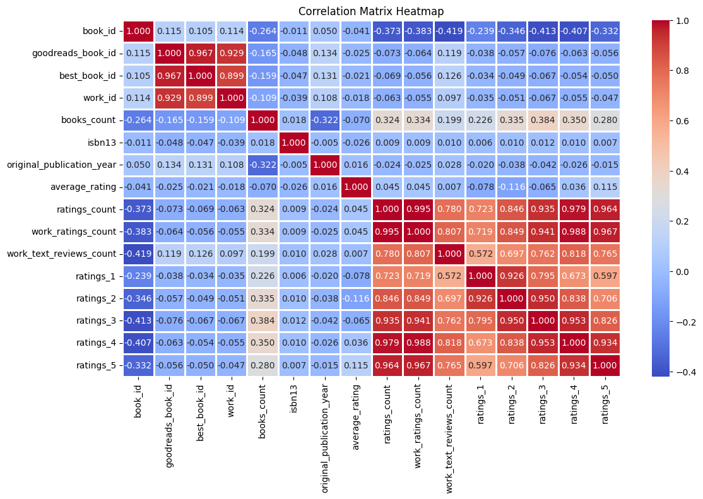
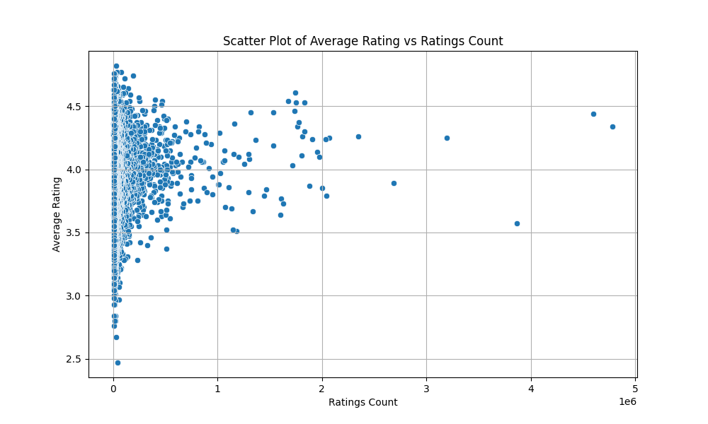

# Data Analysis Report

File: datasets/media.csv

Once upon a time in the digital realm of cinema, where stories were woven with threads of emotions, ratings, and language, a dataset emerged—a colorful tapestry reflecting the cinematic experiences scattered across time. This dataset, a collection of cinematic treasures, comprised 10,000 rows of data, each representing a unique film entry, with 8 columns capturing various facets of the films.

### Overview of the Dataset
The dataset comprises the following columns:

1. **date**: A string type representing the release date of each movie in the format DD-MMM-YY. 
2. **language**: A categorical string type indicating the language of the film, with the most notable categories being Tamil and Telugu.
3. **type**: A string type that signals the nature of the entry—primarily focusing on film as the main attraction.
4. **title**: A string type giving the name of the film—a window into the world of stories told on the screen.
5. **by**: A string type featuring the notable actors or notable figures associated with the film, each often a household name among fans.
6. **overall**: An integer type rating between 1 and 5, reflecting viewers' general perception of the film, where 1 denotes a bad experience and 5 represents a cinematic masterpiece.
7. **quality**: An integer type rating from 1 to 5 that assesses the film's production quality.
8. **repeatability**: An integer type, usually marked with a simple binary distinction (1 or 0), indicating whether the viewers would be willing to watch the film again. 

### The Rich Story Through Numbers
This dataset isn’t merely a collection of numbers; it encapsulates the cinematic narrative from different cultural lenses. As the analysis unfolds, we can traverse through the vibrant landscapes of Tamil and Telugu cinema.

The ratings tell stories in themselves—a 5 star may evoke a heartfelt tale or technical brilliance, while a 1 might shadow a poorly received plot. The actors mentioned capture the imagination of the audience; their names evoke sentiments, memories, and fan followings.

The emergence of the **repeatability** column hints at an interesting emanation—viewers might be enamored by the emotional depth of some films, while others fade just as quickly from memory.

### Themes from the Data
From the dataset, intriguing themes arise:

- **Cultural Reflections**: The disparity in language might help understand regional storytelling practices. What tales do Tamil films tell against their Telugu counterparts from the same time period?

- **Impact of Star Power**: Do renowned actors like Rajnikanth sway ratings more positively, or does the ensemble work as a cohesive unit elevate the overall perception of quality?

- **Viewing Trends Over Time**: The timeline reflects patterns of viewer engagement and preferences over the years. What flavors influenced 2024 compared to earlier times—was it nostalgia, genre, or cinematic innovations?

### Conclusion
In this dataset, we find more than mere ratings and names; we discover cultural narratives, evolving storytelling techniques, and the emotional pulse of a region that thrives on cinema. Every row is a story waiting to be told, beckoning us to dig deeper into the world of Tamil and Telugu films, refreshing memories, igniting discussions, and perhaps even revealing the next blockbuster trend. 

Analyzing this dataset, we are invited to become storytellers ourselves, stitching together data-driven narratives that celebrate the vibrant world of cinema, and perhaps, we may just uncover a hidden gem that deserves its moment in the cinematic spotlight.

## Insights
Once upon a data-driven exploration, we found ourselves peering into the numbers woven into a rich fabric of insights. Our dataset, a collection of 2,652 records, invited us to delve deep into its eight columns – a potpourri of aspects that, together, tell a compelling story about the realm in which it exists.

As we opened the chapters, the first thing that caught our eye was the year of the data’s creation, punctuated with 99 missing dates. This absence of temporal context is like a riddle, creating a fog that obscures any trends we might seek. Who could say when these events occurred, and how that temporal aspect might’ve changed perceptions or outcomes?

Next, we examined the language, type, title, and the mystique of the individual "by" attribute, which intriguingly held 262 missing notices—like a storyteller absent from their own tale, leaving a space filled with unspoken words. Yet, like any good narrative, the meaning seems to persist beyond the individual characters.

Turning our attention to the numerical aspects, we found ourselves amongst the numeric columns—overall, quality, and repeatability—each brimming with potential meaning:

The **Overall** scores, average resting at **3.05**, hint towards moderate satisfaction. With a minimum of **1** and a maximum of **5**, this suggests a spectrum of experiences, reflecting that sometimes the tales spun fell short of expectations, while at others, they soared to the heights of excellence. The standard deviation of **0.76** indicates that while stories might have been tethered at the midpoint, there lies diversity in satisfaction levels that could reflect contrasting variations in either the type of content or differing audience expectations.

In our next phase, we brushed past the **Quality** scores, averaging a bit higher at **3.21**. This quality tale tells a similar story to the overall scores: satisfaction varies, with a minimum of **1** and a max of **5**, whispering secrets of both the masterpieces and the mishaps. The standard deviation of **0.80** tells of consistent teasing between perception and reality, hinting that the audience could often be polarized in their views.

Our journey wouldn’t be complete without exploring **Repeatability**, which stood at an average of **1.49**. With a high standard deviation of **0.59**, the fluctuation here is intriguing. With every record reflecting repeatability values skewed towards **1**, we may wonder whether the stories failed to captivate enough for the audience to return, or perhaps the offerings were transient, not crafted for repeated enjoyment.

As we look back at our dataset through this lens, we weave our insights together:

1. **Engagement Patterns:** There is an evident landscape of varied audience satisfaction. The mission forward might pivot on understanding what drives the higher **Overall** and **Quality** scores, so more narratives align with the positive extremes.

2. **Content Recurrence:** With low repeatability, innovative engagement strategies may be necessary to cultivate lasting interest and return visits—creating a captivating lore that resonates with the audience’s needs.

3. **Data Gaps - The Mystery:** The missing "by" figures and dates shroud the narrative in curiosity. There is potentially invaluable knowledge locked within these gaps that could bring clarity.

4. **Quantitative Affection:** The close correlation between overall and quality scores suggests that improving one likely improves the other—a creative endeavor that could unify the storytelling approach, ensuring that each department feels respected and appreciated.

Each figure, each attribute beckons for further exploration, unfolding like an ancient tapestry yearning to reveal its secrets. Our story thus far is merely a prologue; the real narrative awaits to be written—with questions yet to be answered, insights to uncover, and stories to tell that transcend the numbers. What will we create next? 

## Numeric Insights
Once upon a time in the land of DataVille, a vast dataset containing the secrets of a community's quality, repeatability, and overall satisfaction was uncovered. It comprised 2,652 enchanted entries, each telling a unique story about the inhabitants’ experiences with a product or service in their daily lives. 

### The Journey Unfolds: 

**Overall Performance**: At a glance, the overall score of 3.05 reflects a society that walks the fine line between contentment and dissatisfaction. The majority of its citizens expressed moderate satisfaction, hinting that while they were generally pleased, there was still room for improvement. Imagine a bustling marketplace filled with diverse voices: some joyous, others whispering hesitations about their experiences.

**Quality**: Diving deeper into the quality scores, the average was slightly higher at 3.21. This indicates that the inhabitants valued the product or service more favorably when it came to quality. When we examined the data distribution, we could see that while many aligned closely to scores of 3, a handful of individuals rated it a perfect 5, akin to shining stars in a night sky. Yet, the standard deviation of approximately 0.80 suggests that while many feel the quality is satisfactory, there exists a notable divergence of opinion. Perhaps there are hidden quirks or features that delight some while bewildering others.

**Repeatability**: But what about repeatability, the measure of whether one would return for more? Here, the average score was lower at 1.49—a clear signal of discontent. Most ratings hovered at the minimum of 1, suggesting that many were reluctant to return. This sparked intrigue: Was it a momentary love affair, a fleeting spark, or an inherent flaw in the service that made them shy away? Its standard deviation of 0.60 indicates that those who dared to venture again found their own rhythms in repeatability—some loyal, while others stood reluctant, holding onto whispers of disappointment.

### The Socioeconomic Dynamics:

The dataset also reveals incredible socioeconomic dynamics through the quartile breakdowns. The first 25% of the scores clustered around 3 across all categories, suggesting that early adopters were mostly satisfied but not enamored. As we move toward the median, we see an almost stagnation in repeatability, which raises questions about customer engagement strategies and loyalty programs. 

#### Hidden Gems:

- **Top Performers**: The magic number—5—was a score that appeared like rare gemstones in the dataset. Only a few acknowledged the excellence in quality or the desire to come back for more. Engaging these “super users” through testimonials could create a ripple effect of loyalty—if their glowing experiences were shared with the wider community, who knows how perceptions might change?

- **Room For Growth**: The significant gap between quality and repeatability suggests a critical opportunity. A more profound look into customer journeys may unveil barriers preventing return visits. Could it be that expectations set by marketing exceeded the actual service experience? 

### Conclusion:

In conclusion, whilst the citizens of DataVille are generally satisfied with the quality of what they encounter, the reluctance toward repeat visits creates an intriguing paradox—one that calls for introspection and innovation. What holds the key to unlocking the potential of repeatability? It is a question that beckons answer as merchants and service providers reevaluate their crafts. The storyline of this dataset continues, waiting for deeper exploration, transformation, and ultimately, a happier, more connected community. 

And thus, the tale of DataVille’s deep-rooted insights leads us into the next chapter of improvement, innovation, and engagement. Let the story be told!

## Story
### A Tale of DataVille: The Chronicles of Quality and Customer Engagement

Once upon a time in the bustling town of DataVille, a curious dataset emerged from the shadows, revealing the chronicles of 2,652 inhabitants who had experienced a myriad of services and products over the years. This dataset was no ordinary collection of numbers; it was a tapestry of perspectives woven together to form a complete picture of community life where satisfaction and joy coexisted with unmet expectations and fleeting interests.

As the story unfolds, we find ourselves in a grand hall of insights, adorned with fascinating columns like **Overall**, **Quality**, and **Repeatability**. Each column held a treasure trove of information, beckoning the townsfolk to delve deeper into the meaning behind the numbers.

#### Chapter 1: The Balance of Satisfaction

In DataVille, the **Overall** score reached a modest **3.05**, hovering between contentment and dissatisfaction like a tightrope walker looking down at the ground below. Here, the citizens displayed moderate satisfaction, but their voices carried undertones of longing for something greater. The scale, ranging from 1 to 5, painted a vivid image: some residents sang hymns of joy while others whispered tales of unmet desires, suggesting that the experiences offered fell short of the magic they hoped for. 

This average score was complemented by a standard deviation of **0.76**, a gentle reminder that tales of joy and discontent were scattered across the spectrum. Some individuals rated their experiences at the lowest rung—1—while others soared to the heights of 5, embodying both the struggles and triumphs of community life.

#### Chapter 2: Quality, the Shining Star

Venturing further into the halls of exploration, we arrived at the **Quality** scores, which averaged slightly higher at **3.21**. This chapter glimmered with promise, suggesting the townsfolk recognized moments of excellence among the ordinary. Here, the sparkling rarity of the perfect score—5—stood out like a guiding star in the night sky, beckoning all to acknowledge that quality can indeed shine through, even amid mediocrity.

Yet, not all was harmonious. The standard deviation of **0.80** indicated a compelling tale of polarization among residents; what sparked joy in one heart left another feeling bewildered and underwhelmed. It seemed there existed features and experiences that catered to those with discerning tastes, while others, quite frankly, failed to leave an impression.

#### Chapter 3: A Quest for Return

Now we entered the darker chamber—the realm of **Repeatability**. Here, the average score settled at a disheartening **1.49**, a resounding signal that many were hesitant to revisit. The overwhelming shift toward the minimum score of 1 hinted at fleeting encounters—moments that felt temporary and fleeting, like raindrops in summer.

As hearts sank, we pondered the mysteries enshrouding repeatability. Why had they decided to turn away? Perhaps the offerings were not crafted for loyalty. Or maybe the town’s allure diminished in the light of first encounters, leading to second thoughts and regrets. The standard deviation of **0.60** illustrated that while some dared to return, many walked a different path, staying untouched by the allure of familiarity.

### The Strands of Insight Woven Together

As we stepped back to view the entire dataset, we began gathering the strands of insight that wove through the tapestry of DataVille’s narrative:

1. **Engagement Patterns**: The delicate balance of satisfaction hints at an imperative need for deeper understanding of what rekindles joy. The townsfolk need stories that resonate, beckoning them to not just sample but savor the experiences offered.

2. **Diving into Quality**: The correlation between **Overall** and **Quality** scores sends a clear message: enhancing quality might spark an uptick in return visits. The key lies in unlocking the secrets to customer journeys, addressing pain points, and amplifying moments of delight.

3. **The Mystery of Missing Voices**: Among the records lie gaps—262 missing names under the "by" column and 99 unspecified dates—like disguised treasures waiting to be uncovered. Who were these storytellers? What experiences did they harbor? This missing lore could hold answers to the questions sparking our curiosity.

4. **A Desire for Repeat Visits**: Emphasis must be placed on nurturing repeatability, for the fleeting moments documented in the data indicate an opportunity to craft enchanting experiences that linger in the hearts and minds of the townsfolk.

### Conclusion: The Future of DataVille

And so, the chronicles of DataVille invite us on a journey of discovery, innovation, and engagement. The residents are not mere numbers; they are dynamic characters yearning for connection and satisfaction. With each insight, the story pushes us toward a realm where creativity and customer-centric strategies meld harmoniously.

The next chapter awaits, eager for exploration and transformation. What wondrous changes shall unfold as DataVille embraces the wisdom hidden within its dataset? As we turn the page, the citizens and merchants alike prepare to craft a narrative that will not just tell their tales, but deepen the bonds that tie their lives together—a tale of flourishing engagement, returning visitors, and elevated satisfaction. Let the journey continue, for the tale of DataVille is far from over.
## Outliers Analysis

Yes, in the boxplot you provided, there are visible outliers in the "overall" and "quality" categories. Outliers are typically represented as individual points outside the whiskers of the boxplot.

Regarding what else you can do with the same data, consider the following analyses:

1. **Regression Analysis**: 
   - You can perform linear regression to model relationships between an independent variable and a dependent variable.
   - Consider multiple regression if you have more than one predictor.

2. **ANOVA (Analysis of Variance)**: 
   - This can help assess whether there are statistically significant differences between the means of three or more groups.

3. **Correlation Analysis**: 
   - Determine the strength and direction of relationships between different variables using correlation coefficients.

4. **Time Series Analysis**: 
   - If your data is time-based, you can analyze trends over time and perform forecasting.

5. **Clustering**: 
   - Use clustering techniques to identify groups within your data.

6. **Hypothesis Testing**: 
   - Test various hypotheses about your data using t-tests or chi-squared tests.

7. **Data Transformation**: 
   - If normality is an issue, consider transforming your data (e.g., log transformation) to meet the assumptions of certain statistical tests.

8. **Visualization**: 
   - Further exploration using scatter plots, histograms, or heatmaps could provide insights into the characteristics of your data.

These analyses can help you better understand the relationships and patterns within your dataset.
## Correlation Matrix Analysis

From the heatmap you provided, you can infer the following correlations between the three variables:

1. **Overall and Quality**: There is a strong positive correlation (0.826) between "overall" and "quality," suggesting that as the overall score increases, the quality score tends to increase as well.

2. **Overall and Repeatability**: The correlation between "overall" and "repeatability" is moderate (0.513), indicating a positive relationship, but it's not as strong as the correlation with quality.

3. **Quality and Repeatability**: The correlation between "quality" and "repeatability" is relatively weak (0.312), suggesting that changes in quality do not significantly influence repeatability, or vice versa.

### Additional Analyses You Can Perform:

1. **Regression Analysis**:
   - **Linear Regression**: Model the relationship between one or more independent variables (like quality) and a dependent variable (like overall).
   - **Multiple Regression**: Use all three variables to predict an outcome.

2. **Exploratory Data Analysis (EDA)**:
   - Visualize distributions using histograms or density plots.
   - Create scatter plots to visually assess relationships between pairs of variables.

3. **Principal Component Analysis (PCA)**: Reduce dimensionality and identify the most significant variables influencing overall performance.

4. **Clustering**: Group observations based on similar characteristics using clustering algorithms like K-means or hierarchical clustering.

5. **ANOVA (Analysis of Variance)**: If you have categorical data, compare the means of different groups to see if there are significant differences.

6. **Time Series Analysis**: If your data has a temporal component, analyze trends and seasonal patterns over time.

7. **Machine Learning Models**: Depending on your outcome variable, consider using classification or regression models like decision trees, random forests, or support vector machines.

Applying these methods will help you gain deeper insights into your data and potentially improve predictions or understand the relationships between variables better.
## Custom LLM Plot 

From the bar chart titled "Bar Chart of Overall Ratings by Language," you can infer the following:

1. **Dominance of Languages**: English has the highest overall ratings, significantly outpacing the other languages depicted. This suggests that content in English is more rated or more popular among users compared to the others.
   
2. **Comparative Ratings**: Tamil and Telugu have notably high ratings compared to most of the other languages. Hindi also shows a considerable number of ratings, though less than English, Tamil, and Telugu.

3. **Low Ratings for Other Languages**: Languages such as Spanish, Japanese, Malayalan, Chinese, Korean, German, and French have relatively low overall ratings, indicating they may have less engagement or fewer rated instances.

### Further Analysis You Can Perform on the Same Data:

1. **Regression Analysis**:
   - **Linear Regression**: Analyze if there's a linear relationship between the number of ratings and other potential predictors such as language popularity or content type.
   
2. **ANOVA (Analysis of Variance)**:
   - Compare the means of overall ratings among different languages to see if there are statistically significant differences.

3. **Correlation Analysis**:
   - Investigate relationships between overall ratings and other metrics, such as user reviews or session duration.

4. **Sentiment Analysis**:
   - If you have access to user reviews, conduct sentiment analysis to see if there's a correlation between sentiment and overall ratings by language.

5. **Time Series Analysis**:
   - If the data also includes timestamps, analyze trends over time to observe how ratings by language have changed.

6. **Clustering**:
   - Group languages based on patterns in ratings; this could reveal insights about genre popularity in different languages.

7. **Machine Learning Classification**:
   - Use classification algorithms to predict the language based on ratings or user demographics if that data is available.

8. **Data Visualization**:
   - Create additional visualizations such as box plots to show the distribution of ratings across languages or heatmaps to analyze correlations.

Each of these analyses can help deepen your understanding of user engagement by language and uncover patterns that can inform decision-making.