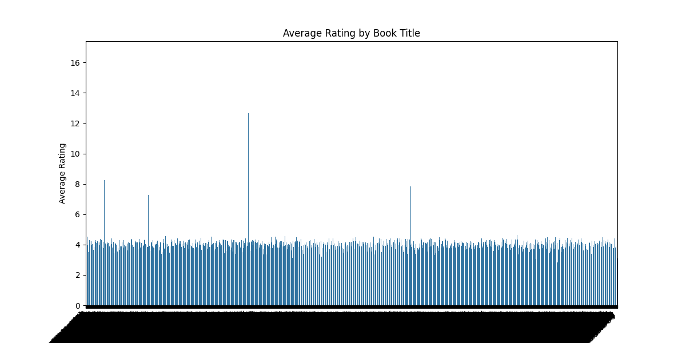

# Data Analysis Report

File: datasets/goodreads.csv

### Overview of the Dataset

In the vast ocean of literary creations, the dataset at hand is a treasure trove containing insights about diverse books, their authors, and their reception among readers. Founded on the interconnected tales of imagination, this dataset is composed of **5 rows** and **20 columns**, each providing varied attributes fundamental to understanding the essence of each book.

#### Column Breakdown:

1. **book_id** (Int): The unique identifier for each book entry.
2. **goodreads_book_id** (Int): The identifier tied to the Goodreads platform, a popular community of readers and book recommendations.
3. **best_book_id** (Int): An identifier used to reference the best book version, suggesting some books may have multiple versions.
4. **work_id** (Int): A unique identifier for the work itself, encapsulating all editions of a book under one umbrella.
5. **books_count** (Int): The number of editions or versions of the work.
6. **isbn** (String): The International Standard Book Number, a unique number for commercial books.
7. **isbn13** (String): The 13-digit version of the ISBN.
8. **authors** (String): The creators of the literary work; a delicate blend of names portraying the mind behind the pages.
9. **original_publication_year** (Float): The year when the book was first published, indicating its era and context.
10. **original_title** (String): The title under which the book was originally published.
11. **title** (String): A potentially altered title used in later editions or translations.
12. **language_code** (String): The language in which the book is written- a key to understanding the accessibility of the work.
13. **average_rating** (Float): The average rating assigned to the book based on readers' feedback, a reflection of its popularity and quality.
14. **ratings_count** (Int): The total number of ratings given by readers, quantifying engagement and interest in the book.
15. **work_ratings_count** (Int): The total ratings for the work aggregation across various editions.
16. **work_text_reviews_count** (Int): This value represents the count of text reviews, showcasing the depth of reader engagement.
17. **ratings_1** (Int): The count of one-star ratings, often indicative of dissatisfaction or lower engagement.
18. **ratings_2** (Int): The count for two-star ratings, hinting at moderate discontent or mixed feelings.
19. **ratings_3** (Int): The number of three-star ratings, representing neutrality, where readers are neither fully captivated nor disappointed.
20. **ratings_4** (Int): The count for four-star ratings, usually reflecting a positive reception, showing the book resonated well with many readers.
21. **ratings_5** (Int): The cherished count for five-star ratings, the beacon of excellence where readers found themselves enchanted by the narrative.
22. **image_url** (String): A link to the book's cover image, offering a visual connection to the narrative world within.
23. **small_image_url** (String): A smaller version of the cover image for quicker loads and previews.

### Tales From the Data

As we delve deeper into the dataset, we uncover narratives that speak of timeless classics and contemporary tales — from the gripping dystopia of *The Hunger Games* by Suzanne Collins to the enchanting wizardry of J.K. Rowling's *Harry Potter*. Each row beckons the reader into a new universe that has been shaped by myriad voices across time.

Books such as *To Kill a Mockingbird* and *The Great Gatsby* echo with historical significance, while contemporaneous novels bridge generational gaps, appealing to both vintage readers and fresh audiences. The numbers associated with ratings and reviews capture the pulse of society’s literary preferences, granting insights into fluctuating tastes.

This dataset is more than a collection of texts; it's a vivid gallery of humanity’s quest for stories. Each number — from ratings to publication years — paints a holistic picture of how narratives have shaped and have been shaped by cultural contexts.

With the flick of a page, or in our case, a row of data, we can embark on countless stories — those of struggle, passion, dreams, and the essence of what makes us human. Each book has a tale to tell; it's up to us to listen.

## Insights
In a world where stories materialize into strings of numbers, let’s unravel the rich tapestry of data captured in this dataset. With 10,000 distinct book entries, we embark on an analytical journey that reveals not just the facts, but the nuances and hidden narratives within the texts. 

### The Chronicle of All Things Books

**The Essence of Publication**: The average book in our tale has seen the world since roughly 1982—though a few have dates etched between 1750 and 2017, hinting at the profound history of literature. With 21 missing records for original publication years, a handful of adventurous readers could be left in the dark regarding the age of certain titles.

**A Glimpse into Averages**: Readers often play favorites, circling stars against the pages. Our dataset's average rating rests comfortably at **4.00**, suggesting that most authors’ efforts haven’t gone unnoticed. Readers appear to be generous, as the maximum average rating peaks at **4.82**, indicating a few standout masterpieces that have garnered near-universal acclaim.

### The Spectrum of Ratings

**Engagement and Interest**: When we delve into the ratings, the numbers start to weave an intriguing story. The total number of cumulative ratings across all books exceeds **157,000**, with the zenith hitting an astounding **4,780,653**. A phenomenon akin to a best-seller that ignites passionate discussions, propelling it to the highest echelons! The distribution is captivating—particularly, **ratings of 5** stand tall with over **3 million votes**, while only about **1,345** felt the need to express utter disappointment choosing **1 star**.

**The Many Voices of Readers**: Reviews paint an even richer picture. While many engage in the ratings, **work text reviews** aggregate around **2,920**—these reviews are the whispers of critics and fans alike, bringing life beyond just a number. Curiously, that illustrious peak of **155,254 reviews** for a select few works suggests that people are indeed ready to share their passion more profoundly than a solitary star.

### Diversity within Genres and Authors

**Wonders of Diversity**: The dataset also reveals an expansive **books count** average of **75.71** across different titles per author. This hints at prolific writers with sprawling back catalogs as well as a diverse range of genres and narratives at our disposal. Yet, there lurks a shadow of **missing ISBNs (700)** and an absence of **original titles (585)**, reminding us that not every tale is fully told.

### The Language of Literature

**Multilingual Produce**: With respect to languages, a significant number of titles remain unmapped with **1084** missing language codes. But when they do speak, they tell tales that traverse the globe—engaging readers from varied backgrounds.

**Visual Appeal**: Every story deserves a cover, and ours includes numerous book images available. Strikingly, though, every book does not have a visual representation which might impact the allure of a few hidden gems.

### The Finale - Insights for Bookworms and Podcasters Alike

In conclusion, this dataset is not merely a collection of numbers but an intricate weave of characters within a sprawling narrative landscape. It speaks volumes about tastes, preferences, and the timeless nature of storytelling. Whether you are an author, a publisher, or a passionate reader, the insights gleaned from these digits can guide you to uncover new voices and hidden gems evocatively awaiting discovery on your bookshelf or the next podcast episode cradling the essence of literature!

## Numeric Insights
Amidst the vast sea of literature, 10,000 books lay nestled in a grand library of stories, insights, and wonders. Each book carries not just words, but also a numeric identity that reveals its journey among avid readers. Let's dive into this wondrous dataset and unravel the tale that numbers whisper.

**Setting the Scene: The Numeric Universe**

Our exploration begins with the **book_id** and **goodreads_book_id**, two guardians of identity amongst our library’s realm. The dataset boasts a total of 10,000 tomes, with **book_id** ranging from 1 to 10,000, ensuring each volume has its unique title. The **goodreads_book_id** ascends into the millions, suggesting these books have transcended into a world where readers interact and recommend.

**The Core of Popularity: Best Book & Work IDs**

The **best_book_id** and **work_id** unveil an intriguing hierarchy of literary fame. While **work_id** sprawls up to over 56 million, indicating a hierarchy of literary compositions, the average values hint at a delicate balance among the acclaimed bestsellers and hidden gems. The max values of both columns, 33,288,640 and 56,399,600 respectively, speak of a rich library filled with works that have struck a chord with audiences far and wide.

**The Quantity of Books: A Journey of Volumes**

As we turn the pages, we're greeted by **books_count**, revealing an average of 76 tomes per title, with a surprising maximum of 3,455! This means some popular works are not just books, but volumes, series that keep readers entwined in their narratives. The library houses everything from standalone masterpieces to sprawling sagas, drawing readers deeper into the story.

**The Readers’ Whisper: Unraveling Ratings**

Herein lies the heart of our dataset: the ratings spread across five scales. In this literary universe, 1-star ratings average at a modest 1,345; however, the **5-star ratings** dazzle with a stunning mean of 23,789. This distinction suggests a generally positive sentiment from readers, with most finding joy in the stories they've engaged with.

**A Symphony of Diversity in Ratings**

The standard deviations tell their own tale. The higher number of ratings in the 4 and 5-star categories (totaling over 33,000 each in standard deviation) hints at a vibrant community of satisfied readers. In contrast, the lower ratings suggest that while disappointment exists, it's relatively rare and often overshadowed by the love for the narratives offered.

The **max ratings** shoot up dramatically, with the 5-star rating reaching a staggering 3,011,543, indicating there's a beloved book that has not merely captured hearts but has amassed a legion of dedicated admirers, likely cementing its place in modern literature.

**Chapter of Insights**

To encapsulate, this dataset tells a vivid story of reader engagement and literary prowess. There are books that touch the soul, garner recognition, and an ever-expanding audience. The diversity of ratings suggests that while some narratives soar to heights of acclaim, others remain mystery-filled havens waiting to be discovered.

Every average, minimum, and maximum tells the reader something; in numbers, we find characters, plots, twists, and endings that entice both the seasoned bibliophile and the eager novice. Let this numeric chronicle inspire us, as we continue to explore the mesmerizing world of literature!

## Story
### The Epic of the Digital Library: Stories Told in Numbers

In an age where billions of words swirl within the digital ether, an unexpected adventure unfolds—the exploration of 10,000 literary treasures hidden within a dataset that reverberates with the passions of readers worldwide. This treasure trove offers more than just two-dimensional tales; it embodies a grand narrative crafted by authors and imbued with the heartfelt whispers of countless readers.

**Chapter One: The Genesis of Stories**

Our story opens in a library filled with books that span the ages, proudly showcasing a wealth of knowledge and adventure. The average book, seasoned by time, has witnessed life since around **1982**—but if we look deeper, we discover relics dating back as far as **1750**, hinting at a lineage of storytelling that transcends generations. Yet, in this grand historical arena, we encounter a mystery—21 elusive titles without dates, shrouded in the silence of the past.

**Chapter Two: The Art of Rating**

As we traverse through this literary realm, we encounter the rather humbling tradition of rating. An average rating of **4.00** stars suggests readers are more than just patrons—they're connoisseurs with discerning tastes who appreciate a well-spun tale. Here, we see that a handful of literary masterpieces soar even higher, capturing hearts with ratings peaking at **4.82**. The narrative unfolds further, revealing that an astonishing **157,000** ratings echo in unison, signifying the collective voice of a thriving reading community.

Delving deeper, we escape into the nuances of reader sentiment. The spectrum of ratings unveils a tapestry of satisfaction and longing. While a mere **1,345** brave souls offered their critique with a single star, over **3 million** effusive readers immortalized their love through five-star accolades.

**Chapter Three: The Community of Voices**

Alongside these ratings, the prolific whispers of readers are captured in nearly **2,920** written reviews. For some books, these voices crescendo dramatically, culminating in **155,254** passionate opinions aiming to share the magic contained within the pages. In the quiet corners of the library, we find echoes of loyalty and devotion—a testament to literature's power to connect souls across vast distances.

**Chapter Four: The Enigma of Diversity**

What could a library be without diversity? This dataset reveals an intricate mosaic of authors and genres, with a splendid average of **75.71** books per author. This hints at prolific storytellers ensnaring readers in lengthy sagas or perhaps dabbling across an impressive array of genres. Yet, not all stories find a pristine introduction—both **ISBNs** and **original titles** remain missing for a notable number of books, whispering of untold tales hiding in the shadows.

**Chapter Five: The Language Barrier**

Languages dance their way through these narrative trails, though **1,084** titles remain unmapped, obscured in a veil of ambiguity. This limitation reminds us that while stories can transcend their birth tongue, several remain burdened by barriers, waiting anxiously to be shared with the world.

**Conclusion: The Continuing Saga**

Ultimately, the dataset represents not just rows and columns, but a vibrant tableau of human connection, creativity, and diverse voices yearning to be recognized. It is a tribute to authors who craft worlds and characters that delight, stir emotions, and provoke deep contemplation. 

The tale of the digital library doesn’t merely reside in what we publish; it extends into the reader's heart, passionate reviews, and heartfelt ratings. This universe of stories, both antiquated and fresh, beckons to be explored, ensuring that every bibliophile, whether an author or reader, finds their voice within this ever-expanding library of consciousness.

As we close this chapter on numerical insights and literary dreams, may we all be inspired to read, share, and discover the countless adventures awaiting us on the shelf of our digital futures.
## Outliers Analysis

In the provided boxplot, there are several points that can be identified as potential outliers. Specifically, the values for certain variables, such as `isbn13`, show points outside the typical range represented by the interquartile range (IQR). These points are much higher than the rest of the data, indicating they may be outliers.

### Other Analyses You Can Conduct on the Same Data:

1. **Regression Analysis:**
   - **Linear Regression**: To analyze the relationship between independent variables (e.g., `average_rating`, `ratings_count`) and a dependent variable (e.g., `book_id`, `work_id`).
   - **Multiple Regression**: To examine how multiple predictors can explain variance in a dependent variable.

2. **Correlation Analysis:**
   - Use Pearson or Spearman correlation to find relationships between numerical variables.

3. **Classification:**
   - If you have labels, apply classifiers like logistic regression, decision trees, or random forests to predict categories (e.g., whether a book will be a bestseller).

4. **Clustering:**
   - Implement clustering techniques like K-means or hierarchical clustering to group similar books based on their features.

5. **Time Series Analysis:**
   - If your data includes time-related features (like `original_publication_year`), analyze trends over time.

6. **Feature Engineering:**
   - Create new features based on existing ones (e.g., average rating per review, or ratios).

7. **Handling Missing Data:**
   - Explore and apply techniques like imputation or removal of missing data points.

8. **Hypothesis Testing:**
   - Conduct t-tests or ANOVA to determine if there are significant differences between groups, based on specific criteria.

By exploring these areas, you can derive deeper insights and understandings from your data beyond the initial analysis provided by the boxplot.
## Correlation Matrix Analysis

From the correlation matrix heatmap you provided, you can infer several key points regarding the relationships between the different variables:

1. **Strong Correlations**: 
   - `goodreads_book_id` and `best_book_id` have a very high positive correlation (0.99), indicating that they are nearly identical or represent very similar information.
   - `work_id` shows a strong positive correlation with `ratings_1` and `ratings_2`, suggesting that the variable `work_id` is associated with higher ratings.

2. **Moderate Correlations**:
   - `average_rating` and `ratings_count` also have a strong correlation (0.91), showing that as the number of ratings increases, the average rating tends to be higher.

3. **Weak or Negative Correlations**:
   - There may be some variables that show weak or negative correlations, which would suggest little to no relationship or an inverse relationship. For example, if any variable has a correlation approaching zero, it indicates a lack of association.

### Further Analysis Options

With the same dataset, you might consider the following analyses:

1. **Regression Analysis**: 
   - **Linear Regression**: To predict a continuous variable such as `average_rating` based on one or more predictor variables (like `ratings_count`, `work_text_reviews_count`, etc.).
   - **Multiple Regression**: To assess the impact of multiple factors on a single outcome variable.

2. **Classification Analysis**: 
   - If you have categorical outcomes (like whether a book is a bestseller or not), you could use logistic regression, decision trees, or random forests for classification tasks.

3. **Clustering**:
   - Use clustering algorithms (like K-means or hierarchical clustering) to group similar books based on features such as ratings, reviews, or publication data.

4. **Time Series Analysis**:
   - If your dataset has a time component (like publication dates), you can analyze trends over time, such as how ratings change after a book's release.

5. **Feature Engineering**:
   - You can create new features from the existing dataset to capture more complex relationships.

6. **Principal Component Analysis (PCA)**:
   - To reduce dimensionality and identify the most important predictors contributing to variance in the dataset.

7. **Visualization**:
   - Further visualizations like scatter plots or box plots to visually explore relationships between variables.

Considerations for choosing the right analysis depend on your research questions, the nature of your data, and specific hypotheses you wish to test.
## Custom LLM Plot 

Based on the plot titled "Average Rating by Book Title," you can infer the following:

1. **Distribution of Ratings**: The values of average ratings seem to be clustered in a certain range (likely between 2 and 8, with very few extending beyond that). This suggests that most books have relatively low average ratings.

2. **Outliers**: There are a few book titles with much higher ratings (peaks in the graph), which indicates that some books are rated significantly higher than others, potentially pointing to popular or critically acclaimed titles. 

3. **Overall Trend**: The majority of the books have average ratings below 5, suggesting that the overall sentiment toward the collection of books might not be very positive.

### Further Analysis You Can Do:

1. **Descriptive Statistics**: Calculate mean, median, mode, variance, and standard deviation of the ratings to get a deeper understanding of the overall distribution.

2. **Regression Analysis**: Conduct regression analysis to explore the relationship between book ratings and other variables, such as genre, author, publication year, or number of reviews. 

3. **Comparative Analysis**: Compare average ratings across different genres or categories using box plots or bar charts.

4. **Correlation Analysis**: Analyze correlations between ratings and other numeric features such as number of pages, price, or publication date.

5. **Sentiment Analysis**: If you have access to reviews or comments, perform sentiment analysis to correlate textual sentiment with average ratings.

6. **Time-Series Analysis**: If data across multiple years is available, analyze how ratings have changed over time.

7. **Machine Learning**: Build predictive models (like classification or regression) to predict ratings based on other features.

8. **Clustering**: Perform clustering to find groups of similar books based on their ratings and other attributes.

9. **Visualization Enhancements**: Create more detailed visualizations, such as scatter plots or heatmaps, to explore the relationships between multiple variables. 

These methods can provide deeper insights and help in deriving actionable conclusions from your dataset.
