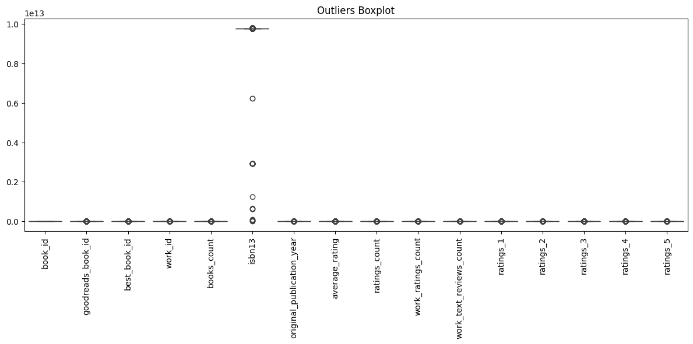
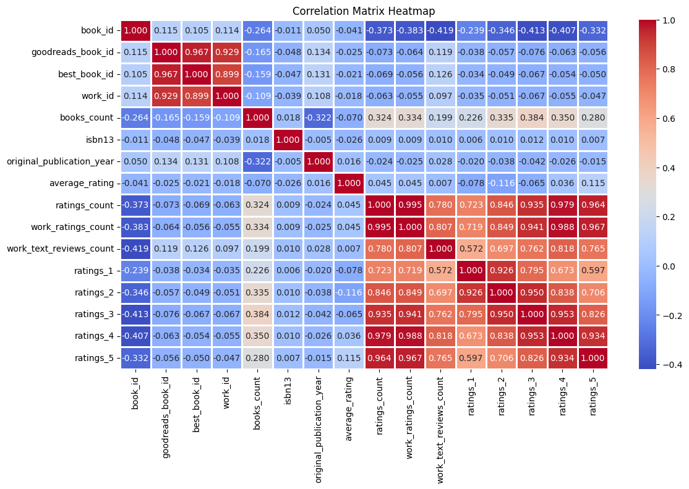

# Data Analysis Report

## Overview
File: datasets/goodreads.csv

## Insights
Once upon a time in the vast digital realm of literature, we stumbled upon a treasure trove of bibliophilic gems—an extensive dataset containing 10,000 wondrous titles, each with unique stories to tell. The dataset acted as a mirror reflecting the landscape of readers' preferences, trends, and literary exploration.

### The Cast of Characters
Among our characters were enchanting **titles** and captivating **authors**. The dataset allowed us to dive deep into the world of books, with **23 columns** narrating tales of popularity and sentiment. The most intriguing features included **average ratings**, **ratings breakdowns**, and the legacy of literary works captured in the **original publication year**.

### A Glimpse into Popularity
As we turned the pages, we discovered that the average rating of these books stood impressively at **4.00**, with a slight variation of **0.25**, casting a positive glow over the literary collection. The maximum average rating recorded was **4.82**, suggesting that some stories left readers utterly spellbound. 

Interestingly, the ratings were abundant: an astonishing **23,789.81** readers bestowed a top score of **5** on their favorites! But as we burrowed deeper, we noticed that not all stories attracted the same level of enthusiasm. The ratings of **1** revealed a stark contrast with just **1,345.04** individuals disillusioned by their reads. These discrepancies led us to ponder: which tales garnered fervent adoration, and which fell flat?

### The Silent Voices
Delving into unseen corners, we uncovered missing voices—the **ISBN** and **ISBN13** codes for certain titles, along with their **original titles** and **language codes**. A total of **700** entries were lacking ISBN numbers, while **1084** entries left questions unanswered regarding language diversity among the books. This indicated that while we had a rich tapestry of stories, some remained hidden or unrecognized in the broader literary world.

The **original publication year** echoed a rich historical narrative. The average year indexed at **1982**, suggesting a crowd of timeless classics mixed with contemporary reads. But what was even more intriguing was the mention of a strange outlier of **-1750**—a fictional journey perhaps, or a typographical anomaly waiting to be resolved!

### The Array of Engagement
Diving into readership engagement, we found the **ratings_count** swelled to an astonishing **54,001**, while the **work_ratings_count** rocketed to **59,687**. Each title was not only heard but also enthusiastically discussed. The reviews, numbering up to **2,919.96**, echoed sentiments and criticisms, reflecting how readers engaged with literary content in diverse ways.

### The Language of Books
Books are universal, transcending borders and languages. Yet, our dataset’s **language code** lacked clarity with **1,084** missing entries, prompting curiosity about the linguistic diversity that could have enriched this collection. Were these stories nestled in languages unknown, waiting for their chance to reach broader audiences?

### Conclusion: The Living Library
This engaging dataset is much more than just rows and columns; it's a living library filled with tales of passion, joy, and sometimes disappointment. The insights gleaned from the numeric quill reveal that while many tales capture the heart and soul of their readers, others serve as reflective surfaces leading to constructive conversations about what resonates in storytelling.

Thus, as analysts, we become not only uncoverers of numbers but also chroniclers of literary narratives, translating data into stories that inspire curiosity, debate, and a deeper appreciation for the art of writing. Whether paving the way for future authors or guiding readers in their quest for the next great read, this dataset is an invaluable portal into understanding human connections through literature.

## Numeric Insights
Once upon a time in the vast world of literature, a treasure trove of data lay hidden, filled with secrets of readers and their favorite books. Our story unfolds as we dive deep into a dataset of 10,000 books, each with its own unique tale, resonating with the hearts of countless readers. 

**The Bookscape Overview:**
As we journey through this numerical landscape, we encounter a myriad of stories, with an average of approximately 75.7 books per author, hinting at the prolific nature of some authors who dominate this digital library. The books range widely, from a humble count of just 1 to an extraordinary 3,455 — a testament to the vast variety within this collection.

**The Rating Chronicles:**
Moving along the pathways of readers' opinions, we discover a tale told through ratings. The average number of 1-star ratings rests at 1,345, hinting at a wide spectrum of tastes; however, as we venture into the realm of 5-star ratings, we find a significant peak of approximately 23,789. This dichotomy suggests that while many have had their favorites, the critical reception is diverse and deeply nuanced.

**A Grand Spectrum of Engagement:**
In the enchanted forest of numbers, we stumble upon the highest recorded rating of 456,191 for a particular book, a figure so monumental it sparks curiosity about what stories drew readers in so profoundly. The rich tapestry of ratings reveals that while some books resonate deeply, garnering massive love, others attract the ire of a handful, reflected in their lower ratings.

**Authorial Legends:**
Diving deeper into the author's influence, we see the median work_id creeping up to over 2.71 million, indicating that certain authors have spun an intricate web of multiple works, compelling readers to follow their journeys. Meanwhile, the best_book_id reveals the editions that have enchanted readers the most — a privilege held by only a few amongst thousands.

**The Peaks and Valleys of Interest:**
Amid this captivating data landscape, we are reminded of the peak rating for 4-star books resting at around 19,965. This tells a dual narrative: while many books endear themselves to readers, there’s a broad range finding themselves precariously positioned at average — a call for a narrative enhancement that could elevate them to new heights.

**The Conclusive Insight:**
From our exploration through the mountains of numbers, it becomes clear: the world of books is not just about words on a page; it’s a living, breathing entity filled with passion, engagement, and the continuous interplay between reader and writer. As the average rating results unveil their stories, they prompt a larger conversation about taste, preference, and the ever-evolving nature of narratives that resonate with the collective psyche of society.

Thus, this dataset is more than just statistics; it is a glimpse into humanity's desires, dreams, and the stories that bind us together as we continue to turn the pages of life.

## Story
Once upon a time, in a vast digital library where stories waited patiently for curious minds, we embarked on an extraordinary exploration of a treasure trove filled with 10,000 books, each a bubble of thought, feeling, and adventure. The dataset we had discovered was not merely numbers and text; it was a portal into the minds of readers and the craft of skilled storytellers.

### The Tapestry of Titles
As we flipped through the pages of this dataset, we were greeted by a diverse array of **titles**, each accompanied by the names of **authors**, allowing us to weave a narrative of the literary journey that had captured hearts around the globe. All at once, we felt ourselves surrounded by **23 columns** that detailed the intricacies of this bookish universe—a universe where **average ratings** revealed the essence of a tale, while counts of reader evaluations painted a vivid picture of public sentiment.

### Illuminating Popularity
In our quest for storytelling, we unearthed a shimmering highlight: the **average rating** of the collected works glimmered at a radiant **4.00**. Just imagine—a ground of 23,789 passionate readers showering their favorite tales with a dazzling **5-star** rating! Yet, among them lurked a mere **1,345** souls who found their literary choices unworthy, giving their selected reads a despondent **1-star** score. What secrets lay beneath the spectrum of ratings? What stories won hearts or caused them to stumble?

### The Silent Narratives
As any avid reader knows, some books get lost in the quiet corners of libraries, and our dataset revealed its whispers. A significant number of entries—**700** to be precise—were left without **ISBN** codes, akin to a book without a spine. Further, **1,084** language codes wandered aimlessly, hiding the rich diversity that spanned the globe. Where were the tales of different cultures? They beckoned from the shadows, yearning to be discovered and unveiled.

Adding another layer of complexity was the **original publication year**, which danced between time periods with an average dating back to **1982**. Yet an enigmatic outlier appeared: **-1750** intrigued and puzzled—was it an imaginative narrative whispering of time-travel and fantastical tales, or merely an error awaiting correction?

### The Reader's Engagement
Venturing deeper into the heart of engagement, we uncovered a community thriving on discussions and critiques, evident in the **54,001** ratings and an epic **59,687** work ratings that echoed through the virtual halls. The allure of books transcended mere numbers, sparking dialogues through **2,919 reviews** which vocally articulated the joys and despairs of their reading experiences. Each review unfolded like the petals of a flower, revealing layers of reader engagement and connection with characters who inspired them.

### The Language of Human Experience
Books have a unique power—they can speak all tongues, yet the murmur of our data revealed an unsettling truth. The **language code**, cloaked in mystery with over **1,084 missing** entries, reminded us that while many voices were celebrated, a multitude lay silent, waiting for their stories to reach beyond geographical confines. What linguistic treasures awaited us if we ventured to translate and share them?

### Conclusion: The Living Chronicles
In this extensive exploration, we came to understand that our dataset was a living chronicle—a tapestry of human experiences waiting to be woven into new stories. Each number, each entry—an echo of a reader's heart, a whisper from a beloved author. As analysts and storytellers, we transformed rows of data into vibrant narratives, bridging the gap between numbers and the rich essence of storytelling.

Our findings led us to an undeniable conclusion: the world of books resembles a vast landscape teeming with life, where desires and dreams intertwine, creating an everlasting connection between reader and story. Each rating, each author, and each title contribute to an evolving narrative of what it means to turn pages, to explore worlds unknown, and to embark on literary journeys that shape our collective identity.

In the end, the dataset transformed into a treasure map guiding readers to their next great adventure, as the heartbeats within those pages beckoned us back for more—forever turning, forever discovering, and forever enchanted by the stories that bind us all.
## Outliers Analysis

From the boxplot designed to show outliers in the dataset, you can infer several points:

1. **Identification of Outliers**: The boxplot highlights points that are significantly higher or lower than the rest of the data. These outliers can indicate anomalies, errors in data collection, or interesting variations worth investigating.

2. **Features Analyzed**: Various features of the dataset are represented along the x-axis (e.g., `book_id`, `goodreads_book_id`, `best_book_id`, etc.). Each feature can have outliers based on its distribution.

3. **Spread of Data**: The length of the boxes and whiskers indicates the spread of the data. A longer whisker may signify more variability within that feature.

4. **Concentration of Data**:  Features such as `ratings_count` and `work_reviews_count` may have concentrations of data closer to the median, while others may show more variability.

5. **Further Investigation**: Outliers warrant further examination. You may want to look into specific cases to determine whether they represent legitimate observations or require data cleaning.

6. **Scale and Units**: The y-axis suggests some features may vary greatly in scale (e.g., `isbn13` has values in the trillions), indicating different units or measures across features.

Each of these aspects contributes to a broader understanding of the dataset, potentially guiding further analysis or cleaning efforts.
## Correlation Matrix Analysis

From the provided correlation matrix heatmap, you can infer the following:

1. **Strong Correlations:**
   - The highest correlation of 1.00 is observed when variables are compared with themselves (e.g., `book_id` with `book_id`).
   - Other strong correlations (close to 1 or -1) indicate a strong linear relationship. For example, if `original_publication_year` shows a strong positive correlation with `work_ratings_count`, it suggests that as the publication year increases, the ratings count also tends to increase.

2. **Positive and Negative Correlations:**
   - Positive values (e.g., above 0.5) suggest that as one variable increases, the other variable tends to also increase. Conversely, negative values (e.g., below -0.5) indicate an inverse relationship.

3. **Weak Correlations:**
   - Values around 0 suggest little to no linear relationship between the variables. For example, if `average_rating` shows a low correlation with `ratings_1`, it implies that the average rating does not predict the count of lowest ratings.

4. **Interdependence of Features:**
   - Various features may influence each other. For example, a high correlation between `work_text_reviews_count` and `work_ratings_count` may suggest that more reviews are associated with higher ratings.

5. **Potential Insights for Analysis:**
   - Certain variables could be key performance indicators. Understanding which factors correlate significantly can help prioritize which data to focus on for predictive modeling or further analysis.

6. **Data Cleaning or Transformation:**
   - If certain variables have a high correlation with one another, this might indicate redundancy which could impact model performance. Dimensionality reduction techniques (like PCA) could be helpful.

In summary, the heatmap provides a valuable visual representation of how multiple factors are interrelated, guiding future analyses or modeling strategies.
## Summary Statistics
{'row_count': 10000, 'column_count': 23, 'columns': {'book_id': dtype('int64'), 'goodreads_book_id': dtype('int64'), 'best_book_id': dtype('int64'), 'work_id': dtype('int64'), 'books_count': dtype('int64'), 'isbn': dtype('O'), 'isbn13': dtype('float64'), 'authors': dtype('O'), 'original_publication_year': dtype('float64'), 'original_title': dtype('O'), 'title': dtype('O'), 'language_code': dtype('O'), 'average_rating': dtype('float64'), 'ratings_count': dtype('int64'), 'work_ratings_count': dtype('int64'), 'work_text_reviews_count': dtype('int64'), 'ratings_1': dtype('int64'), 'ratings_2': dtype('int64'), 'ratings_3': dtype('int64'), 'ratings_4': dtype('int64'), 'ratings_5': dtype('int64'), 'image_url': dtype('O'), 'small_image_url': dtype('O')}, 'missing_values': {'book_id': 0, 'goodreads_book_id': 0, 'best_book_id': 0, 'work_id': 0, 'books_count': 0, 'isbn': 700, 'isbn13': 585, 'authors': 0, 'original_publication_year': 21, 'original_title': 585, 'title': 0, 'language_code': 1084, 'average_rating': 0, 'ratings_count': 0, 'work_ratings_count': 0, 'work_text_reviews_count': 0, 'ratings_1': 0, 'ratings_2': 0, 'ratings_3': 0, 'ratings_4': 0, 'ratings_5': 0, 'image_url': 0, 'small_image_url': 0}, 'descriptive_summary':                                            mean                  std          min              25%              50%              75%              max
book_id                                  5000.5           2886.89568          1.0          2500.75           5000.5          7500.25          10000.0
goodreads_book_id                  5264696.5132        7575461.86359          1.0         46275.75         394965.5       9382225.25       33288638.0
best_book_id                       5471213.5801        7827329.89072          1.0         47911.75         425123.5        9636112.5       35534230.0
work_id                            8646183.4246       11751060.82408         87.0        1008841.0        2719524.5      14517748.25       56399597.0
books_count                             75.7127           170.470728          1.0             23.0             40.0             67.0           3455.0
isbn                                        NaN                  NaN          NaN              NaN              NaN              NaN              NaN
isbn13                     9755044298883.462891  442861920665.573364  195170342.0  9780316192995.0  9780451528640.0  9780830777175.0  9790007672390.0
authors                                     NaN                  NaN          NaN              NaN              NaN              NaN              NaN
original_publication_year           1981.987674           152.576665      -1750.0           1990.0           2004.0           2011.0           2017.0
original_title                              NaN                  NaN          NaN              NaN              NaN              NaN              NaN
title                                       NaN                  NaN          NaN              NaN              NaN              NaN              NaN
language_code                               NaN                  NaN          NaN              NaN              NaN              NaN              NaN
average_rating                         4.002191             0.254427         2.47             3.85             4.02             4.18             4.82
ratings_count                        54001.2351        157369.956436       2716.0         13568.75          21155.5          41053.5        4780653.0
work_ratings_count                   59687.3216        167803.785237       5510.0         15438.75          23832.5          45915.0        4942365.0
work_text_reviews_count               2919.9553          6124.378132          3.0            694.0           1402.0          2744.25         155254.0
ratings_1                             1345.0406          6635.626263         11.0            196.0            391.0            885.0         456191.0
ratings_2                              3110.885          9717.123578         30.0            656.0           1163.0          2353.25         436802.0
ratings_3                            11475.8938         28546.449183        323.0           3112.0           4894.0           9287.0         793319.0
ratings_4                            19965.6966         51447.358384        750.0          5405.75           8269.5          16023.5        1481305.0
ratings_5                            23789.8056         79768.885611        754.0           5334.0           8836.0          17304.5        3011543.0
image_url                                   NaN                  NaN          NaN              NaN              NaN              NaN              NaN
small_image_url                             NaN                  NaN          NaN              NaN              NaN              NaN              NaN}

## Missing Values
book_id                         0
goodreads_book_id               0
best_book_id                    0
work_id                         0
books_count                     0
isbn                          700
isbn13                        585
authors                         0
original_publication_year      21
original_title                585
title                           0
language_code                1084
average_rating                  0
ratings_count                   0
work_ratings_count              0
work_text_reviews_count         0
ratings_1                       0
ratings_2                       0
ratings_3                       0
ratings_4                       0
ratings_5                       0
image_url                       0
small_image_url                 0
dtype: int64

