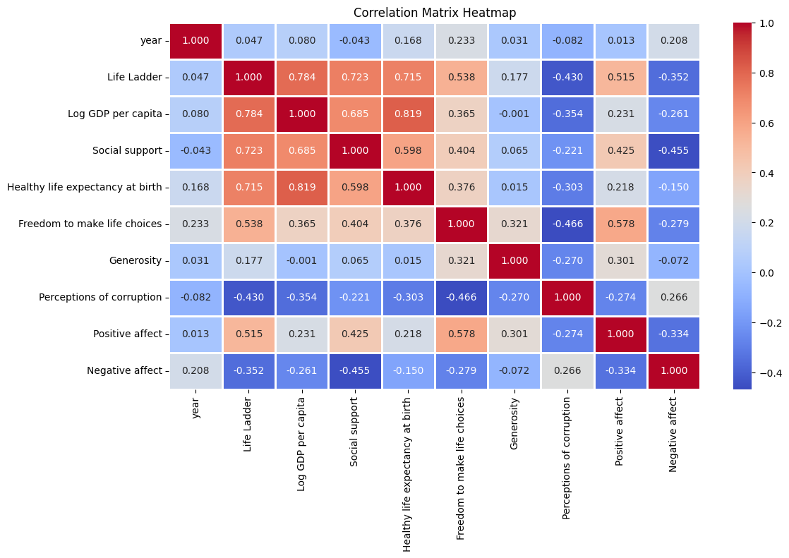

# Data Analysis Report

## Overview
File: datasets/happiness.csv

## Insights
**Title: The Art of Happiness: A Global Journey Through Life Satisfaction and Economic Indicators**

In a world that often feels divided, numbers tell a story that transcends borders, cultures, and languages. Our dataset, richly illustrated with insights from 2,363 observations captured through 11 illuminating variables, invites us into the intimate tapestry of life satisfaction across different countries and years. The overarching theme? The delicate balance between economics and happiness.

**A Journey Through Time and Space**

The dataset spans multiple years, with records slicing through time from 2005 to 2023. Throughout this temporal journey, we encounter the "Life Ladder," a contemplative measure of subjective well-being, which presents an intriguing average value of 5.48—with a peak at 8.02 and a troubling trough at 1.28. There exists a dichotomy in life satisfaction: Some bask in the sunlight of happiness, while others wander in the shadows of despair.

**The Economic Canvas of Happiness**

Diving deeper, we find the "Log GDP per capita," which stands as a formidable economic indicator that mirrors the prosperity of nations. The average calculated at approximately 9.40 suggests a correlation between wealth and well-being, but not all that glitters with gold... 

The correlation between Log GDP per capita and Life Ladder is worth noting. While wealthiness provides a robust foundation for life satisfaction, our dataset reveals that mere possession of material wealth does not guarantee happiness, as it is fraught with nuances shaped by social support, freedom, and a sense of agency.

**Social Support: The Unsung Hero**

Speaking of support — another enlightening component is "Social support," which averages at 0.81. Countries where strong familial bonds, community ties, and social networks flourish see the brightest reflections on the Life Ladder. In contrast, nations grappling with a lack of societal engagement and support often experience lower life satisfaction. This draws attention to the profound influence of relationships on our overall well-being: investing in social capital might be just as essential as boosting economic metrics.

**Choice and Freedom: The Essence of Happiness**

Next, we stumble upon "Freedom to make life choices," which garners an average score of 0.75. This variable embodies the pulse of autonomy in our lives. The more freedom individuals feel they possess, the higher their life satisfaction scores tend to climb. It tells us that happiness is often tied not just to what we have, but to our ability to shape our own destinies.

**Generosity and Perceptions of Corruption: The Powerful Contrasts**

Our findings also reveal contrasting dimensions in the elements of "Generosity" and "Perceptions of corruption." The glaring statistic of 81 missing values for generosity hints at potential disparities in measuring altruistic behavior across countries. Nonetheless, the average score is a meager 0.000098, suggesting that acts of giving are relatively rare or perhaps underreported in our data.

Conversely, we see that countries with higher perceptions of corruption (average score of 0.74) tend to struggle with life satisfaction as well. This illustrates the toll that corruption exacts on society—when trust degrades, happiness follows suit.

**The Emotional Landscape: Positive and Negative Affect**

Lastly, we delve into the emotional realms, represented by "Positive affect" (average 0.65) and "Negative affect" (average 0.27). The interplay of these emotions illustrates the complex human experience. Life satisfaction is enriched by positive experiences but deeply impacted by negative ones. The striking difference in averages between positive and negative affects further indicates that while people might generally experience positivity, the shadows of distress lurk nearby, often affecting their overall happiness.

**Conclusion: A Call to Action**

From the vibrancy of life satisfaction rates to the sometimes painful reality of economic measures, this dataset provides a compelling narrative woven with hopes, struggles, and aspirations. The insights gleaned should empower policymakers, social workers, and individuals alike to recognize the interconnected nature of economic, social, and emotional indicators.

As we navigate this modern era, let us not forget that investments in social ties, freedom, and genuine support can pave pathways to greater happiness, turning stark statistics into a flourishing future of contentment and connection. In the end, we realize that happiness is indeed an art, and with every brush stroke of empathy, understanding, and action, we can create a masterpiece that includes every member of our global community.

## Numeric Insights
Once upon a time in the kingdom of Data-Land, a curious group of analysts was assembling on a grand quest—to uncover the secrets of happiness and prosperity hidden within the numeric scrolls of their most prized dataset. With gleaming eyes and deep passion for discovery, they set forth on a journey of exploration, armed with their trusty statistical tools. 

As they gathered around a large table, they laid out their treasure: a summary of numeric columns spanning nearly two decades, from the year 2005 to 2023. The analysts knew that each column represented a unique dimension of the well-being of their citizens—a tapestry woven from the threads of statistics, society, and sentiments.

### The Era of Enchantment: **Life Ladder**
The first column, “Life Ladder,” represented the overarching narrative of happiness, with values ranging from a lowly 1.281 to an astounding 8.019. The analysts were intrigued by the average score of 5.48—a decent 56% of the maximum happiness potential. They noticed a standard deviation of 1.13, indicating diverse perceptions of well-being across the kingdoms. A transformative spark appeared as they saw the rising trend from the 25th percentile of 4.65 to the 75th percentile of 6.32, signifying a growing sense of joy—could it be due to the kingdom’s progressive policies?

### The Wealthy Wards: **Log GDP per capita**
Next, the analysts’ attention shifted to “Log GDP per capita.” With its mean of approximately 9.40, the realm appeared relatively prosperous, although some regions remained in the shadows with a minimum of 5.53. The upward swell of the distribution—echoed by a standard deviation of 1.15—told them that while some citizens basked in abundance, others strived to make ends meet. As they explored the box plots, they noted how wealth was not uniformly distributed; this would require deeper investigation to uncover the hidden barriers.

### Bonds of Togetherness: **Social support**
The analysts pondered the column on “Social support,” with a robust average of 0.81—a beacon of camaraderie in the realm. This metric revealed something powerful; it was often said that happiness blooms in the garden of support. But alas! The standard deviation of 0.12 hinted at variability—some citizens felt a warm embrace of community, while others saw only isolation. 

### The Generosity Paradox
Soon, the analysts turned their gaze towards “Generosity.” The tale told by these numbers showcased an average of 0.0001, with a generous upper boundary of 0.70. While the maximum hinted at individuals of great giving hearts, the central tendency told a tale of muted kindness throughout the kingdom. It sparked a profound discussion: should they cultivate charity in their realms, or were there underlying societal constraints hindering giving?

### Shades of Trust: **Perceptions of corruption**
A whisper echoed through the table—“Perceptions of corruption”. With a mean value of 0.74, this number cast a shadow over their feast of discovery. The analysts sharpened their quills, realizing that positive societal constructs might be tarnished by mistrust. The standard deviation of 0.18 suggested that beliefs in trustworthiness varied greatly among the citizens—some felt secure, while others were ensnared in suspicion.

### A Dance of Emotions: **Positive and Negative affects**
Lastly, they observed “Positive affect” and “Negative affect”—two opposing allies in the emotional saga. The positive affect sourced an average of 0.65, while the negative counterpart lingered at 0.27. The narrative reframed as they reflected that even in times of joy, moments of sorrow danced alongside, reminding them that the complexity of the human experience is what made their quests rich and illuminating.

In the glow of their investigation, the analysts recognized a profound truth: happiness and prosperity are not merely numbers but a tapestry woven from the threads of society, economy, and emotions. Each column in their dataset was a brushstroke in an evolving masterpiece. 

United in their newfound knowledge, they crafted a compelling tale to guide policymakers in their endeavors. They proposed initiatives to bolster social support, promote transparency, increase generosity, and weave together the fragmented elements of society to not only uplift the Life Ladder but create a harmonious kingdom where every citizen could thrive. And so, in the heart of Data-Land, the journey continued—one of continual discovery, understanding, and collective joy.

## Story
### Title: “The Harmony of Happiness: A Chronicle of Our Times”

Once upon a time, in realms abundant with data and dreams, a troop of analysts gathered to uncover the golden threads of happiness as woven through the tapestry of human experience. They had in their possession a grand scroll of numeric wisdom—2,363 records shimmering under the light of 11 eloquent variables, each a story waiting to unfold.

**Chapter One: The Life Ladder Beckons**

The analysts first unveiled the “Life Ladder,” a gauge of satisfaction and well-being that beckoned them from the annals of time, stretching from the year 2005 to 2023. The average score of 5.48 resonated like a distant bell, summoning forth both jubilant and solemn reflections of life. Of course, 8.02—the blissful peak—cast a splendid glow, while 1.28, the gloomy low, reminded the analysts of the shadows lurking in corners yet explored.

But the analysts were not disheartened. They noted the upward trend: those enchanting strides from the 25th percentile at 4.65 to a brighter 6.32 at the 75th percentile signaled a world on the ascent. It was as if from within the timeline, humanity was embarking upon a renaissance of resilience. 

**Chapter Two: The Gold Standard of Prosperity**

As they turned the scroll, they encountered “Log GDP per capita,” a rich realm characterized by its mean of approximately 9.4. The numbers sung of prosperity, yet they harmonized a solemn note—material wealth, while vital, was merely one side of the coin. The analysts could see through the ebb and flow of the economic landscape; wealth was not distributed evenly, and the disparity called for attention.

Thus, they isolated the correlation with the Life Ladder, drawn like an artist’s brush across the canvas of society. Yes, money could buy comfort, but it could not guarantee the elation of a joyful existence. 

**Chapter Three: Threads of Connection, Strands of Support**

With eager anticipation, the analysts unraveled the next chapter—“Social support.” Averaging at 0.81, this was the heart of the narrative; the bonds between people were paramount. Yet, like a tangled skein of yarn, they found variability in its strength, as indicated by a standard deviation reflecting a community where some basked in warm embraces and others felt isolated in their solitude.

This realization ignited a spark in the analysts’ minds: Perhaps policies promoting unity, understanding, and kinship could work wonders in elevating the Life Ladder across nations.

**Chapter Four: The Generosity Dilemma**

A curious twist emerged in the tale—the “Generosity” column. The analysts paused at the almost whispering average of 0.000098. Though potential for kindness existed, it remained tucked beneath societal constraints. The stark contrast between the maximum of 0.7 and the pervasive lack of giving forced them to ponder: What kind of cultures breed generosity? 

While their findings hinted at an underlying phenomenon of altruistic behavior being underreported, they envisioned initiatives that would nurture the roots of benevolence in communities. They imagined a world where a simple act of kindness could ripple through society like a pebble tossed into a vast pond, creating waves of goodwill.

**Chapter Five: The Shadows of Trust**

In a quiet moment, the analysts turned to “Perceptions of corruption.” The average of 0.74 cast a daunting shadow over their findings. This single variable held a mirror to societal trust, revealing inconsistencies where beliefs varied wildly. Trust, they understood, was the lifeblood of happiness; where it waned, so too did satisfaction.

With a mixture of wonder and concern, the analysts envisioned policies focusing on transparency and accountability—torchbearers against the shadows of corruption, providing citizens with the assurance needed to thrive in their pursuits.

**Chapter Six: The Emotional Symphony of Life**

Finally, the analysts marveled at the emotional dimensions unfolding before them—the “Positive affect” averaged at 0.65, while “Negative affect” lingered at 0.27. It was a delicate dance of feelings, a reminder that even in midst of joy, the echoes of despair can reverberate profoundly. 

These columns embodied the rich complexity of human experience, a testament to resilience amidst trials. The analysts proposed initiatives fostering mental well-being—workshops, outreach programs, and community driven events that would nurture the emotional landscape.

**Epilogue: A Collective Call to Action**

Empowered by their exploration, the analysts stepped into the light, ready to guide a world towards greater understanding and compassion. They shared a clarion call to policymakers, educators, and communities: Recognize that happiness is an art best painted with collective effort and empathy. 

Together, they imagined a future where Life Ladders could rise, where economic prosperity met flourishing social connections, and where freedom to choose nurtured a deep-seated sense of fulfillment in every citizen. 

Thus, through the chronicles of data, the analysts acclaimed: “Happiness is not merely a destination but a lifelong journey—one that thrives on bonds of love, trust, and the courage to dream.” And so, in their kingdom of Data, the adventure of happiness continued, ever beckoning for more stories to be told, and more lives to be touched.
## Outliers Analysis

From the boxplot you've provided, here's what you can infer about outliers in the dataset:

1. **Outliers Identification**: The plot specifically highlights outliers for various variables. Each box represents the interquartile range (IQR), and points that lie outside the whiskers are considered outliers.

2. **Variable Analysis**:
   - **Year**: There are several outliers, indicating that certain entries for "year" might be unusually high.
   - **Life Ladder, Log GDP per Capita, Social Support**: These variables show a relatively compact range with fewer or no outliers, suggesting that the data points are closely clustered around the median.
   - **Healthy Life Expectancy at Birth**: There are potential outliers, indicating variability in life expectancy across the dataset.
   - **Freedom to Make Life Choices, Generosity, Perceptions of Corruption, Positive Affect, Negative Affect**: These variables might have more uniform data based on the boxplot, possibly indicating less variability or fewer extreme values.

3. **Further Investigation**: The presence of outliers may warrant further investigation to understand the reasons behind these extreme values. Outliers may indicate data entry errors, unique cases, or significant trends that require deeper analysis.

4. **Data Distribution**: The overall distribution suggests which attributes might be more stable or consistent across the dataset versus which have significant variability.

5. **Potential Influences**: High outliers could suggest specific conditions or factors impacting certain areas significantly (e.g., economic conditions, mental health perceptions) that could be worth researching further.

In summary, the boxplot provides a visual summary of the range and distribution of the dataset while indicating where the outliers lie, prompting questions about their causes and significance.
## Correlation Matrix Analysis

From the correlation matrix heatmap, you can infer the following:

1. **Positive Correlations**:
   - **Life Ladder and Healthy Life Expectancy at Birth (0.929)**: This indicates a strong positive relationship between overall life satisfaction and healthy life expectancy. As one increases, the other tends to increase as well.
   - **Life Ladder and Log GDP per capita (0.647)**: There's a moderate positive correlation, suggesting that higher GDP per capita is associated with higher life satisfaction.
   - **Social Support and Life Ladder (0.757)**: A strong correlation, indicating that individuals who perceive greater social support tend to report higher life satisfaction.

2. **Negative Correlations**:
   - **Generosity and Negative Affect (-0.543)**: There's a moderate negative correlation, suggesting that higher levels of generosity are associated with lower levels of negative feelings.
   - **Freedom to make life choices and Negative Affect (-0.399)**: Indicates that more freedom in making choices correlates with reduced feelings of negativity.

3. **Weak Correlations**:
   - **Year and most variables**: The correlation with year is generally weak, suggesting that the year does not have a strong relationship with the other metrics in this context.

4. **Other Notable Observations**:
   - **Perceptions of corruption and Life Ladder (-0.223)**: This suggests a weak negative correlation, implying that perceptions of corruption could slightly detract from life satisfaction.
   - **Healthy Life Expectancy at Birth and Positive Affect (0.761)**: A strong positive association, indicating that healthier individuals tend to report more positive emotions.

This heatmap provides insights into how various factors relate to overall life satisfaction and well-being across the dataset, highlighting areas for potential focus in studies or policy development.
## Summary Statistics
{'row_count': 2363, 'column_count': 11, 'columns': {'Country name': dtype('O'), 'year': dtype('int64'), 'Life Ladder': dtype('float64'), 'Log GDP per capita': dtype('float64'), 'Social support': dtype('float64'), 'Healthy life expectancy at birth': dtype('float64'), 'Freedom to make life choices': dtype('float64'), 'Generosity': dtype('float64'), 'Perceptions of corruption': dtype('float64'), 'Positive affect': dtype('float64'), 'Negative affect': dtype('float64')}, 'missing_values': {'Country name': 0, 'year': 0, 'Life Ladder': 0, 'Log GDP per capita': 28, 'Social support': 13, 'Healthy life expectancy at birth': 63, 'Freedom to make life choices': 36, 'Generosity': 81, 'Perceptions of corruption': 125, 'Positive affect': 24, 'Negative affect': 16}, 'descriptive_summary':                                         mean       std     min     25%     50%      75%     max
Country name                             NaN       NaN     NaN     NaN     NaN      NaN     NaN
year                              2014.76386  5.059436  2005.0  2011.0  2015.0   2019.0  2023.0
Life Ladder                         5.483566  1.125522   1.281   4.647   5.449   6.3235   8.019
Log GDP per capita                  9.399671  1.152069   5.527  8.5065   9.503  10.3925  11.676
Social support                      0.809369  0.121212   0.228   0.744  0.8345    0.904   0.987
Healthy life expectancy at birth   63.401828  6.842644    6.72  59.195    65.1  68.5525    74.6
Freedom to make life choices        0.750282  0.139357   0.228   0.661   0.771    0.862   0.985
Generosity                          0.000098  0.161388   -0.34  -0.112  -0.022  0.09375     0.7
Perceptions of corruption           0.743971  0.184865   0.035   0.687  0.7985  0.86775   0.983
Positive affect                     0.651882   0.10624   0.179   0.572   0.663    0.737   0.884
Negative affect                     0.273151  0.087131   0.083   0.209   0.262    0.326   0.705}

## Missing Values
Country name                          0
year                                  0
Life Ladder                           0
Log GDP per capita                   28
Social support                       13
Healthy life expectancy at birth     63
Freedom to make life choices         36
Generosity                           81
Perceptions of corruption           125
Positive affect                      24
Negative affect                      16
dtype: int64

