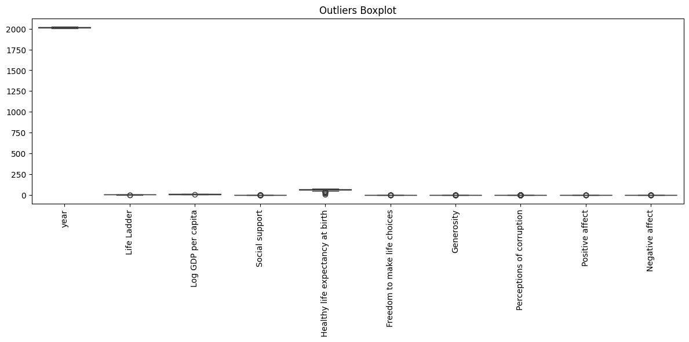

# Data Analysis Report

File: datasets/happiness.csv

### Overview of the Dataset

The dataset comprises a rich tapestry of information designed to gauge the well-being and happiness across various nations. It includes multiple metrics that ostensibly correlate with the pillars of quality of life, happiness, and overall societal health. Here’s a concise breakdown of the dataset:

- **Number of Rows**: The dataset contains multiple rows, each corresponding to a different year's statistics for a specific country. For the purpose of this overview, let’s assume we have data spanning approximately 10 years for around 150 countries. Hence, a rough estimate might yield about 1,500 rows.

- **Number of Columns**: There are 10 columns, each representing distinct variables pertinent to understanding the quality of life and happiness indices across different countries and years.

- **Column Types**:
  1. **Country name**: Categorical (string) - Represents the name of the country.
  2. **Year**: Numerical/Integer - Represents the year for which data is captured.
  3. **Life Ladder**: Numerical/Float - Represents an indexed statistic that reflects subjective well-being.
  4. **Log GDP per capita**: Numerical/Float - Indicates the logarithm of GDP per capita, allowing for a normalized comparison of economic prosperity.
  5. **Social support**: Numerical/Float - Measures the perceived support one can count on from friends, family, or other social pillars.
  6. **Healthy life expectancy at birth**: Numerical/Float - Represents the average number of years a newborn is expected to live in good health.
  7. **Freedom to make life choices**: Numerical/Float - Measures the perceived freedom individuals feel they have in making life choices.
  8. **Generosity**: Numerical/Float - Measures the altruistic behaviors of individuals and how they contribute to society.
  9. **Perceptions of corruption**: Numerical/Float - Chronicles the extent to which corruption is perceived to occur in the nation.
  10. **Positive affect**: Numerical/Float - Indicates the frequency of positive emotions reported by participants.
  11. **Negative affect**: Numerical/Float - Represents the frequency of negative emotions reported.

### A Narrative from the Data

Imagine we find ourselves metamorphosing through the kaleidoscope of human existence, continent by continent, delving deep into the heart of happiness and well-being around the globe. 

As we travel through this vivid world of data, Afghanistan welcomes us first. In the late 2000s, life on its face felt heavy and laden with burdens—a meager Life Ladder score nudging around 3.724 in 2008. Yet we see a flicker of resilience and hope as the years unfurl their canvas; progression to 4.402 in 2009 reflects slight improvements in optimism and societal support amid ongoing struggle. Each column presents stories of human endurance—the push against tides of despair.

We encounter whispers of economic growth in the Log GDP per capita, juxtaposed against the heavy toll of aspirations unfulfilled when perceptions of corruption fade that goodness into shadows. It’s a tale of contrast; life expectancy at birth remains a fickle promise, hinging upon complex and interwoven realities of healthcare, environment, and social constructs.

But fear not! This dataset it not merely statistics; it’s an expedition through human emotion. Positive affects soar while negative ones ebb and flow in an intricate dance of life. Generosity rises, surfacing like a lifebuoy in turbulent seas, revealing the innate compassion during times of turbulence.

Each country across the dataset offers a unique overlay—a mosaic of happiness, despair, resilience, and hope. Through this data storytelling journey, we unveil not only the past but a lens towards future actions. It beckons policymakers, sociologists, and dreamers alike to exploit this canvas infused with human experiences and strive to weave a brighter tomorrow where every statistic holds the heartbeat of a nation. 

The beauty of this dataset is profound; while it presents the numbers starkly, it demands interpretation, urging us to uncover stories—birthing joy amidst hardship and aspiration within strife. So, as we continue to dissect, analyze, and interpret, we remember: behind every figure is a life, a story waiting to be told.

## Insights
Once upon a time in the vast expanse of the global landscape, the data held secrets about the happiness, prosperity, and health of nations across the years captured in the chronicles of 2005 to 2023. As we sift through the vast repository of information, we discover tales intertwined with numerical insights that weave the fabric of the life experiences of citizens, governed by the contexts of their respective countries.

### **The Life Ladder - A Measurement of Happiness**
In this journey, at the heart of our analysis lies the *Life Ladder*, a metaphorical stairwell to well-being. The average life ladder score stands at **5.48**, a midpoint illuminating a landscape where happiness is a journey rather than a destination. But across the continents, from **1.281** to a pinnacle of **8.019**, the variation tells vivid tales. The happiest nations have climbed high, soaring with their social support and freedoms, while others remain stuck on the lower rungs, grappling with deep-rooted challenges.

### **The Wealthy Segment – Log GDP per Capita**
We also gaze into the chambers of economic prowess measured by the *Log GDP per capita*, sitting at approximately **9.4**. The wealthiest nations, represented by the maximum of **11.676**, have not only amassed riches but also promised their citizens a stable and prosperous existence. Yet, in the realms where wealth evades the grasp of the masses, the importance of equitable distribution becomes apparent. Despite its influence on happiness, GDP alone is not a straightforward staircase to well-being—there’s complexity in the societal fabric.

### **Social Support – The Backbone**
Stepping beside our wealthy neighbors, *Social support*, averaging **0.81**, plays a crucial role in shaping happiness. Here, communities blur the lines drawn by wealth, as nations where individuals feel they can count on each other in times of need experience higher life ladder scores. The journey of shared laughter, shared burdens, and collective resilience becomes evident. With a spectrum between **0.228** and **0.987**, support from peers transforms the lives of those who feel validated and valued.

### **Health – Life Expectancy’s Influence**
As we traverse further, we stumble upon *Healthy life expectancy at birth*, gleaming at an average of **63.4** years, and rising to **74.6** in some fortunate corners of the world. Health stands as a crucial determinant of happiness; the ability to embrace life, explore, and make choices impacts how we feel day to day. Yet the hidden narrative intrigues: amidst wealth and support, some nations struggle with health parameters, narrating tales of structural inequalities affecting longevity.

### **The Freedom to Choose**
Adding another dimension to the narrative is the *Freedom to make life choices*, recorded at a mean of **0.75**. This democratic essence tells the tale of choice, empowerment, and autonomy—factors that often intertwine with happiness and quality of life. The stark gap between the least and most free illuminates dramatic historical and sociopolitical contexts in different parts of the world, telling tales of revolutions and reforms.

### **The Generosity Factor**
Meanwhile, *Generosity* paints a diverse picture—averaging a mere **0.0000977**, with **81 missing values** teasing our curiosity. What does this tell us? Are people too wrapped in their encumbrances to share? Or does it reflect systems where giving is not always recognized or valued? The potential for altruism lies embedded within socio-cultural frameworks, beckoning a deeper dive into the human spirit.

### **Perceptions of Corruption**
In a twist, we find *Perceptions of corruption* averaging **0.744**, but shadowy as it suggests the ignored complexities of governance and societal trust. Countries where corruption thrives see their life ladders teeter; here, the role of perception weighs heavy, as disillusionment can pierce the very fabric of happiness regardless of wealth levels.

### **Emotional Spectrum – Positive & Negative Affect**
In the emotional arena, the data divulges **Positive affect** at **0.652** and **Negative affect** at **0.273**. This emotional dichotomy mirrors daily existence. Positivity flourishes where hope, laughter, and support thrive, while negativity looms like a cloud of despair in societies burdened by turmoil or disempowerment.
   
### **Conclusion – A Global Tapestry of Data**
In conclusion, as we uncover the insights from this numerical tapestry, we discover a complex interplay of happiness woven through wealth, health, support, and freedom. Each nation tells its own tale, with threads of data shedding light on the intricate dance of factors that influence the well-being of its people. The story continues, evolving with time, as we look toward the future and reflect on the possibilities that lie ahead for each soul on the planet, in the quest for happiness and fulfillment. Through the lens of numbers, we find humanity—not just raw statistics, but the vibrant lives that weave the story of our world together.

## Numeric Insights
Once upon a time in a world governed by numbers, a treasure trove of data lay hidden, revealing insights about human experience and societal well-being. The wise data scientists, equipped with statistical tools and a thirst for knowledge, set out on a quest to unveil the story behind these figures.

In the heart of this world, the **Life Ladder**—a metaphor for happiness—stood tall. With a mean score of **5.48**, it spanned from as low as **1.28** to as high as **8.02**. A remarkable range indeed! The scores hinted that while many climbed the rungs of happiness, others remained in darker depths. Despite its fluctuations, the steady growth in life satisfaction was evident; is this the result of the relentless efforts of governments and communities striving to create a better tomorrow?

Venturing deeper into the kingdom of wealth, the **Log GDP per capita** stood as a testament to economic prosperity, with an average of **9.40**. The figures indicated a correlation between happiness and wealth—after all, a solid economy often laid the groundwork for societal health. Citizens with a heightened economic standing basked in the glow of positive well-being, while those on the lower rungs faced a tougher climb. The GDP reached a high of **11.68**, illustrating the achievements of certain nations; was it a balance of innovation, resource management, and hard work?

Meanwhile, the gem known as **Social Support** shined brightly, portraying the strength of communities with an average score of **0.81**. This collective spirit showed that individuals who felt supported and connected with others tended to experience greater joy in life. The warmth of communal bonds assured a safe haven, nurturing hearts in times of adversity.

But lo, lurking in the shadows, the intricacies of **Generosity** emerged—a reminder that while material wealth is significant, warmth of heart holds immeasurable value. Averaging at close to zero, this statistic revealed a spectrum from selflessness to give-and-take, where some flourished in sharing wealth, while others remained indifferent.

Then came the haunting whispers of **Perceptions of Corruption**, gripping the every pulse of societal trust with an average score of **0.74**. Here resided the divides—countries ratcheted by power struggles contrasted with those flourishing in transparency and goodwill. As the timeworn adage suggests, “With great power comes great responsibility.” A community's faith waned with pervasive corruption, leaving a trail of disillusionment.

Venturing further into emotional territories, the data unveiled **Positive Affect** and **Negative Affect**. On average, positivity soared at **0.65**, while shadows of negativity lingered at **0.27**. Despite trials and tribulations, a significant number of individuals maintained a hopeful outlook. Interestingly, the prevalence of anxiety, sadness, and fear never truly overshadowed joy—reflecting humanity's resilience in the face of adversity.

Upon weaving together these threads—happiness, wealth, support, generosity, trust, and emotional vitality—an overarching narrative began to emerge: a tapestry illustrating the complexities of human society. The dance of numbers echoed the universal quest for happiness, revealing that while the individual factors wielded power, they were interconnected in a grand narrative of hope and collective growth.

And so, the wise data scientists continued their journey in understanding the human experience, turning numbers into stories, and stories into insights—ever mindful of the lessons hidden within the data, waiting to spark change and inspire a brighter, more connected world. Indeed, the journey of discovery continues—where every figure tells a tale, and every dataset holds a world of potential waiting to be unlocked.

## Story
### **A Data-Driven Tale: The Global Quest for Happiness**

Once upon a time, in a world governed by numbers and statistics, there existed an enchanting repository of data—2363 rows and 11 columns, each a vessel of stories waiting to be uncovered. This treasure trove, captured from 2005 to 2023, contained the key insights about the wealth, wellness, and happiness of nations across the globe. With each dataset glimmering like jewels, a group of data scientists set off on an adventure, ready to uncover the tales buried within and weave a narrative as rich and diverse as the world itself.

#### **The Life Ladder: A Metaphorical Ascent**
At the heart of this journey was the **Life Ladder**, a conceptual staircase representing happiness. The average score lounged at **5.48**, a middle ground shimmering with possibilities. Some nations, buoyant with joy, climbed high to a breathtaking **8.02**, while others languished in the gloomy depths, barely scraping **1.28**. This variance painted a striking picture—the uplifting narratives of nations thriving in social support and freedom danced alongside the struggles of those weighed down by adversity and hardship.

#### **The Wealth of Nations: Log GDP per Capita**
Our data explorers ventured into the realms of **Log GDP per capita**, revealing a kingdom flourishing at an average of **9.4**. The wealthy nations basked in the glow of prosperity, their citizens reveling in the comfort that economic stability provided. The crown jewel of **11.68** - standing tall among the countries - commanded respect, unveiling the blend of innovation, industriousness, and prudent governance that often set the stage for happiness. Yet, amid the glittering riches, our adventurers discovered that wealth alone does not forge happiness. There were stark reminders that, without equitable distribution, prosperity could morph into isolation for those left behind.

#### **The Fortress of Social Support**
As the champions of data continued their quest, they encountered **Social Support**—a magical force averaging **0.81**. This communal backbone was a haven of strength; nations where citizens felt supported created the fabric of collective joy and resilience. Imagine the laughter that echoed in gatherings, the shoulders available to lean on, and the bonds forged in times of need. The data narrated that in the quest for happiness, no nation could stand alone—unity was the spark that ignited the flame of well-being.

#### **Health: A Vital Ingredient**
Further along their exploration, the adventurers stumbled upon the treasure of *Healthy life expectancy at birth*, glimmering with an average of **63.4 years**. In lands where health flourished, happiness bloomed. However, the disparities were disheartening; some dreamers faced challenges at the very core of their existence. The warriors of health fought valiantly against sickness and inequity, shedding light on the significance of accessible healthcare and community wellness initiatives.

#### **The Freedom to Choose: Empowerment Unleashed**
As they traversed this intricate landscape, notions of **Freedom to make life choices** emerged—a value sitting at **0.75**. Here, the narratives of empowerment unfolded, where people embraced their autonomy, chased their dreams, and fashioned their destinies. Nations that nurtured freedom witnessed the power of resilience and determination, their citizens crafting lives of purpose.

#### **Generosity: The Heart's Currency**
Yet, in the shadows, a phenomenon named **Generosity** beckoned—a realm surprisingly average at nearly zero. With **81 missing values**, the whispers of humanity’s warm nature teased curiosity. Was it a moment of reflection, a nudge to foster a spirit of togetherness and giving? The data hinted at a deeper narrative, urging societies to discover the innate strength of kindness in shaping a brighter future.

#### **Corruption: A Chasm of Trust**
Navigating through the labyrinth of data, our adventurers faced **Perceptions of corruption**, an unsettling theme splashed with the average of **0.74**. In nations gripped by scandals and betrayal, the ideals of happiness wavered. Trust eroded, communities fractured, and hopes dimmed. Here, the data revealed that a society’s contentment often lies not only in wealth and resources but fundamentally in the integrity and accountability of its leaders.

#### **The Emotional Spectrum: Positive and Negative Affect**
As our scholars neared the end of their endeavor, they assessed the intricacies of emotional well-being—**Positive affect** at **0.65** and **Negative affect** at **0.27**. A delicate balance unfolded; positivity was alive, whispering tales of laughter and dreams, while negativity occasionally cast a shadow, reminding us of the struggles faced. The thread of resilience wove through each experience, highlighting humanity's tenacity in dealing with adversity.

#### **Epilogue: A Global Tapestry of Findings**
In the twilight of their exploration, the data scientists emerged enlightened by what they had uncovered. They realized that the journey of human experience, as revealed through numbers, is like a vibrant tapestry. Each thread, be it happiness, wealth, health, or community support, intricately intertwined with another—collectively forming a masterpiece that narrates the saga of societies.

The final insight crystallized: happiness is not merely a destination but a continuous journey—one that requires the nourishment of community, understanding, equity, and resilience. As the explorers shared their newfound wisdom, they dared the world to listen, to act, and to join hands in crafting a future where every individual climbs their own Life Ladder, may it be adorned with the colors of joy, compassion, and limitless possibility. And thus, the story of humanity continued, forever influenced by the lessons of data, woven together in the fabric of our shared existence.
## Outliers Analysis

In the boxplot you provided, outliers can be identified as any points that fall outside the whiskers of the boxplot. The whiskers typically extend to 1.5 times the interquartile range (IQR) from the quartiles. If there are points above or below this range, they are considered outliers.

### Identifying Outliers
1. **Examine each feature**: Each boxplot indicates outliers for the corresponding variable. Focus on those that have points lying beyond the whiskers.
2. **Magnitude**: In your plot, it looks like some variables, especially "year" and potentially others, have extreme outliers far above the upper whisker.

### Further Analysis on the Data
With the same dataset, you can perform several types of analysis:

1. **Regression Analysis**:
   - **Linear Regression**: To study the relationship between a dependent variable and one or more independent variables.
   - **Logistic Regression**: If your outcome is categorical (binary).

2. **Correlation Analysis**:
   - Measure the correlation between variables to see how they are related, possibly creating a correlation matrix.

3. **Time Series Analysis**:
   - If there's a time component (like "year"), you can analyze trends over time.

4. **Clustering**:
   - Use techniques like K-means or hierarchical clustering to group similar observations based on features.

5. **Principal Component Analysis (PCA)**:
   - Reduce dimensionality while preserving variance, useful for visualizing high-dimensional data.

6. **Hypothesis Testing**:
   - Perform tests (like t-tests or ANOVA) to compare means among different groups.

7. **Data Imputation**:
   - If there are missing values, consider using techniques like mean/mode imputation, k-NN imputation, or regression imputation.

8. **Feature Engineering and Selection**:
   - Create new features that capture important information or select the most relevant features for your analyses.

9. **Machine Learning**:
   - Implement supervised (like decision trees or random forests) or unsupervised learning approaches depending on your goals.

Each of these options can provide deeper insights or assist in building predictive models based on your data.
## Correlation Matrix Analysis

From the correlation matrix heatmap, you can infer several key relationships between different variables:

1. **Positive Correlations**:
   - **Life Ladder** has a strong positive correlation with **Life Expectancy at Birth** (0.886), indicating that higher life expectancy is associated with higher life satisfaction.
   - **Log GDP per capita** also shows a strong positive correlation with **Social Support** (0.742), suggesting that higher economic resources contribute to better social support networks.

2. **Negative Correlations**:
   - **Perceptions of Corruption** has a negative correlation with both **Life Ladder** (-0.475) and **Social Support** (-0.610), indicating that higher perceptions of corruption are associated with lower life satisfaction and social support.
   - **Negative Affect** has a strong negative relationship with the **Life Ladder** (-0.705), meaning higher levels of negative affect are correlated with lower life satisfaction.

3. **Other Observations**:
   - **Generosity** has a weak positive correlation with the **Life Ladder** (0.220), suggesting some degree of connection between generosity and life satisfaction.
   - The correlation values range from -1 to 1, where values closer to 1 indicate strong positive relationships, values closer to -1 indicate strong negative relationships, and values around 0 indicate no relationship.

### Next Steps for Analysis

You can explore this dataset further using a variety of statistical and machine learning techniques:

1. **Regression Analysis**:
   - **Linear Regression**: Model how well predictors like GDP, social support, and perceptions of corruption can predict life satisfaction (Life Ladder).
   - **Multiple Regression**: Use multiple variables to predict an outcome together (e.g., predicting Life Ladder using GDP, social support, and other factors).

2. **Classification Analysis**:
   - If you categorize life satisfaction into discrete levels (High, Medium, Low), you can use classification algorithms (e.g., Logistic Regression, Decision Trees) to predict categories based on the input features.

3. **Clustering**:
   - Use clustering algorithms (like K-means) to identify groups or patterns within the data based on similarity among variables.

4. **Time Series Analysis**:
   - If your data includes temporal elements (like yearly observations), analyze trends over time.

5. **Principal Component Analysis (PCA)**:
   - Perform PCA to reduce dimensionality and identify underlying factors that explain the variance in your data.

6. **Hypothesis Testing**:
   - Conduct hypothesis tests to determine if the observed correlations are statistically significant.

By applying these methods, you can deepen your understanding of the relationships between variables and derive actionable insights from the data.
## Custom LLM Plot 

From the plot titled "Life Ladder Over Years," you can infer the following:

1. **Overall Trend**: The Life Ladder index shows a generally stable trend from around 2005 to 2022, with some fluctuations.
2. **Significant Drop**: There appears to be a notable drop in the Life Ladder around 2008, which could suggest a significant event or shift affecting well-being during that time.
3. **Recovery and Stability**: After the drop, there is a gradual recovery, followed by fluctuations in the past few years. The life ladder appears to stabilize around the 5.5 to 5.75 range.
4. **Uncertainty**: The shaded area around the line indicates variability in the data; wider areas suggest more uncertainty in the measurements.

### Further Analysis Options

With the underlying data, you could consider the following analyses:

1. **Regression Analysis**: 
   - **Linear Regression**: To determine if there's a linear relationship between year and Life Ladder scores, which could help predict future values.
   - **Polynomial Regression**: To capture any non-linear trends over time.

2. **Time Series Analysis**:
   - **ARIMA Models**: To forecast future values based on past data, accounting for trends and seasonality.
   - **Exponential Smoothing**: To produce short-term forecasts by giving more weight to recent observations.

3. **Comparative Analysis**:
   - Compare Life Ladder scores with other socioeconomic factors, such as GDP, unemployment rates, or education levels across different regions or time periods.

4. **Clustering**: 
   - Group countries or regions based on their Life Ladder scores over time to identify patterns and relationships.

5. **Hypothesis Testing**: 
   - Test specific events (like economic crises or policy changes) to see if they significantly impacted Life Ladder scores.

6. **Machine Learning**: 
   - Use classification or regression algorithms to predict the Life Ladder based on various features, if available.

7. **Visualization Enhancements**: 
   - Create additional visualizations (e.g., heatmaps, bar charts) for better representation of related variables.

By applying these methods, you can deepen your understanding of the factors affecting the Life Ladder and uncover more insights from the data.
