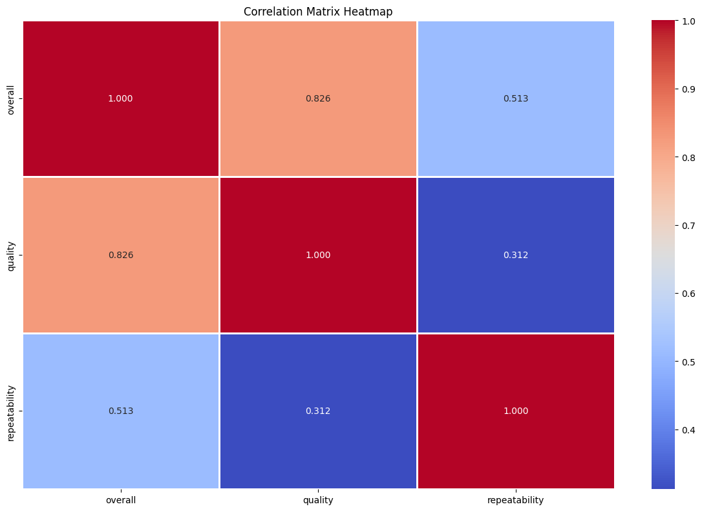

# Data Analysis Report

## Overview
File: datasets/media.csv

## Insights
In the rich tapestry of data storytelling, we sometimes find threads of intrigue, patterns of behavior, and insights that weave together to narrate a compelling saga. This dataset, comprising 2652 rows and 8 columns, presents an opportunity to explore a realm of ratings and reviews, characterized by its missing dates and contributors, leaving us with tales left to be told.

### The Characters – Who Invited This Dataset?
- **Language** and **Type**: These columns hint at diversity – languages and types of content are integral but appear free of missing data, setting the stage for a global narrative. Could we uncover a multilingual world, all while exploring different genres of content, or perhaps educational materials?
  
- **Title**: No missing titles here, which allows us a glimpse into the specific pieces being rated – albeit with some degree of mystery as to their full context.

- **By**: The column indicating contributors has significant missing values (262 entries), introducing an enigmatic element. Who remains unrecognized, and do their opinions differ from those who were recorded? Was it a well-known entity, or possibly an overlooked contributor whose insights could have shifted perceptions?

### The Plot - Scores and Sentiments
Delving into the overall rating, quality of content, and repeatability reveals a somewhat comforting narrative:
- **Overall Ratings**: The average score hovers around **3.05**. This suggests that the content is generally viewed as acceptable but not spectacular. Our protagonists might have moments of brilliance but tend to keep it safe, like a good TV series rather than a blockbuster movie.
  
- **Quality Ratings**: Averaging at **3.21**, the quality adds a nuanced layer. It's slightly above average, suggesting content that, while not universally lauded, manages to maintain relevance. Could this represent a trend of crowd-pleasing works?

- **Repeatability Ratings**: The average repeatability of **1.49** indicates that content is possibly more of a one-time experience; perhaps once you've seen it, there's little incentive to return—an intriguing notion about the transient nature of engagement.

### The Missing Links – A Call for Resolution
A quick glance at the missing values surfaces key areas that need addressing:
- With **99 missing dates**, we find important timestamps drifting away, obscuring the context that could have illuminated temporal trends. Were there spikes in ratings at certain periods, or are they merely scattered across a timeline?
  
- The contributors, with significant gaps, remind us of unknown voices whose absence could change our interpretation. Were they critics, lay viewers, or industry insiders? Their insights might carry weight—an editorial voice left unheard.

### The Conclusion – What Lies Ahead
In the analysis of this dataset, we uncover a world straddling the ordinary and the extraordinary. A place where the unrecognized is as significant as the acclaimed. To complete this narrative, we would need to fill in the gaps—investigate the missing dates, explore who the contributors were, and what their absence might mean. 

Ultimately, this dataset tells a broader story about content consumption—its popularity, challenges in engagement, and the ongoing need for diverse narratives, all while beckoning deeper questions of quality versus quantity in our rapidly evolving digital landscape. Will the unsung voices rise, or will those few remaining records define the plot of our modern age? The answer lies within the next steps—let's embark on a journey of exploration and analysis to uncover more layers of this intriguing story.

## Numeric Insights
As we dive into the narrative of this dataset, we find ourselves on an exploratory journey through the realms of three vital metrics: overall performance, quality, and repeatability. Each numeric column serves as a character in our story, revealing unique aspects of a larger phenomenon.

**The Protagonist: Overall Performance**

In the world of overall performance, represented by a mean of approximately 3.05, we discover a character that exemplifies a decent baseline. With a standard deviation of 0.76, this character possesses a moderate level of volatility, hinting that it is neither outstanding nor entirely lacking. It operates between the extremes, standing tall at a maximum of 5 but often resting comfortably at a score of 3.

Looking closer, the quartiles tell an intriguing story of stability. The lower 25% of the data is firmly at the score of 3, illustrating that a significant portion of our participants finds themselves at a solid par. However, the peaks come into play at the upper quartiles, with a few reaching for the heights of 5. Here, we see the aspiration and ambition leak into the storyline but also reveal the struggles some face to aspire and reach their true potential.

**The Companion: Quality**

Supporting our protagonist is the quality metric. With a mean of approximately 3.21, quality captivates the audience with a slightly elevated perception compared to overall performance. Its standard deviation is a touch higher at 0.80, suggesting that there’s a bit more drama in its journey.

Minimum and maximum values tell us that quality is grounded at 1 but can soar alongside overall performance to a splendid 5. The first quartile lingers at 3 as well, but it showcases a slightly more generous upper bound, with the third quartile nudging to 4. This indicates that many participants manage to achieve higher quality, despite the challenges—and this might be a reflection of their training, experience, or the resources available to them.

**The Enigma: Repeatability**

And here enters repeatability into our narrative; a character less frequently discussed yet extremely crucial. With a mean shy of 1.5, its understated presence contrasts sharply with overall performance and quality. This suggests that most instances revolve around a lower scale of achievement, with patrons struggling to reach consistency. The maximum value of 3 hints that while there are some instances of commendable repeatability, they are a rare sight in this tale.

Exploring quartiles unveils a stark reality: the first and median quartiles stand rigid at 1, emphasizing a struggle to maintain repeatability across the board. Only in the play of the third quartile do we see glimpses of potential, revealing that there are but a few who have managed to break the clutches of inconsistency.

**Epilogue: The Interwoven Narrative**

As these threads of overall performance, quality, and repeatability intertwine, they breed a complex narrative. While overall performance and quality stand together in solidarity—a duo that, while capable of remarkable feats, showcases varying degrees of success—repeatability lingers behind, embodying a challenge that many face. This narrative compels us to delve deeper, to unravel the reasons behind these gaps, and to seek solutions that transcend the barriers presented by the current data.

This analysis leaves us with a quest: to understand how we can lift up the character of repeatability, to ensure that all players in this story can find their footing and reach for their peaks, transforming ordinary metrics into extraordinary achievements. Will they rise to the occasion? Only time—and further analysis—will tell.

## Story
Once upon a time, in the vibrant realm of data, a treasure trove was unearthed. This dataset, a clandestine library of scores and sentiments, held 2,652 unique scrolls—the whispers of wisdom from the world of content ratings. Like enigmatic fragments of an unfinished tapestry, each scroll revealed clues, etched with the ink of reviewers’ thoughts, even as some threads appeared frayed, waiting to be woven together.

### Chapter 1: The Unsung Voices

In the land of Revieweria, where opinions danced like fireflies in the night, two illustrious figures stood on opposite sides of a great divide: **Language** and **Type**. They spoke in every tongue imaginable and belonged to diverse categories of artistry. Together they curiously represented the richness of Revieweria, free from doubt, unclouded by missing fragments, suggesting this world thrummed with multicultural narratives and varied genres, each beckoning understanding. 

Yet, a shroud of mystery cloaked the **By** column, where 262 names remained concealed in the shadows. Did these absent voices harbor the stardust of brilliance, or were they destined to blend into a background of forgotten tales? In the absence of their narratives, it became a riddle even the wisest sages had yet to solve. 

### Chapter 2: The Journey of Ratings

As the search for answers deepened, the heart of the scroll revealed intriguing landmarks—**Overall**, **Quality**, and **Repeatability** ratings intertwined as they journeyed through the realities of audiences and creators alike.

The **Protagonist**, Overall Performance, with an average score of 3.05, captured the essence of mediocrity. It resembled a brochure for a quaint inn: inviting yet modest, offering charm without grandeur. This figure loomed over the land, occasional bursts of brilliance("the peaks of 5") punctuating its humdrum existence. The wide expanse of scores indicated a fickle audience, with performance oscillating between acceptable fare and fleeting excitement. 

Supporting our protagonist was **Quality**, slightly more illustrious, coming in with an average of 3.21. This companion led audiences to moments of satisfaction, delivering modest yet perceptibly better experiences amidst rocky terrain. An exploration of the highest scoring content suggested a flickering hope—a yearning for more dramatic encounters that reflected deeper quality. 

At last, making a quiet entrance, we encountered **Repeatability**—the humble sibling embodying quiet struggle. With a rating that barely brushed 1.5, this character embodied the transient nature of engagement, echoing the collective decision that a singular experience sufficed. Loneliness lingered in its corners, evoking a sense of yearning for deeper connection.

### Chapter 3: The Gaps Beneath the Surface

As the seekers delved further, they stumbled upon the chasms left by the **missing data**, 99 dates strewn like autumn leaves blown away by the wind. Each date represented a turning point that could unveil emotional peaks and valleys—moments when opinions flourished, outbursts of love or disdain swept across Revieweria. Perhaps, too, they would find the magic threshold, a time when uninhibited creativity shone through, igniting passion in otherwise placid waters.

The absence of contributions was reminiscent of a forest ripe with trees yet lacking the song of birds. Who were these elusive contributors? Did their echoes still ripple through the realm? What words of wisdom lay unspoken, their valuable insights waiting silently to be discovered? The possibilities seemed boundless, yearnings and dreams steeped in the unknown.

### Conclusion: The Next Step of Our Adventure

As the winds whispered through the valleys of Revieweria, its inhabitants understood—an essential journey awaited them. To recover the lost voices and uncover the hidden stories, they would need to scour the uncharted realms and venture into new territories. 

New queries would follow, uncovering the missing dates, inviting unresolved voices to speak, and capturing the journeys of experience on this evolving canvas. For in every story, whether of mild discouragement or spirited enthusiasm, lay the universal desire for connection, understanding, and transformation.

Thus, the adventure would bloom; the tapestry enriched with deeper insights, including the nurturing touch of humanity. In the pursuit of meaning and connection, Revieweria held the promise of growth—a continuous journey where even the smallest voices could find relevance amid the chorus of narrations.

Will the narrative evolve, or will it stagnate in the stubborn shades of mediocrity? As the data storytellers hatch their plans, one truth remains: the real journey has only just begun. Let's embark on this exploration to reveal the next chapters, and perhaps even more captivating tales yet unheard.
## Outliers Analysis

From the provided boxplot, you can infer several key aspects about the dataset concerning the three categories: "overall," "quality," and "repeatability."

1. **Boxplot Structure**:
   - Each box represents the interquartile range (IQR), showing the middle 50% of the data.
   - The line inside each box indicates the median of the dataset.
   - The "whiskers" extend to show the rest of the distribution, except for points that are considered outliers.

2. **Outliers**:
   - The presence of individual points outside the whiskers indicates outliers in each category.
   - "Overall" and "quality" have multiple outliers, suggesting variability or extreme values within these datasets.
   - "Repeatability" has fewer or no visible outliers, indicating more consistent data.

3. **Comparison of Categories**:
   - The median of "quality" is higher than "overall," suggesting that the quality ratings are generally better or more favorable.
   - The "repeatability" category shows the lowest median, indicating that repeatability might be a more challenging or lower-rated aspect compared to overall and quality.

4. **Variability**:
   - The range (the difference between the highest and lowest values) appears wider in "overall" and "quality," signifying more variability in those categories compared to "repeatability."

5. **Data Distribution**:
   - If the boxes are not symmetrically placed within the whiskers, it may indicate skewness in the data for that category.

Overall, this boxplot effectively highlights the presence of outliers and allows for a comparative analysis between the different categories in relation to their medians and spread.
## Correlation Matrix Analysis

From the correlation matrix heatmap, you can infer the following:

1. **Correlation Strength**: The values in the heatmap represent the Pearson correlation coefficients between the variables:
   - **Overall and Quality**: There is a strong positive correlation (0.826), indicating that as the overall score increases, the quality score tends to increase as well.
   - **Overall and Repeatability**: There is a moderate positive correlation (0.513), suggesting a positive relationship, but it is weaker than the correlation between overall and quality.
   - **Quality and Repeatability**: The correlation is relatively low (0.312), indicating a weaker relationship between these two variables.

2. **Diagonal Values**: The diagonal values are all 1.000, which is expected as they represent the correlation of each variable with itself.

3. **Color Coding**: The heatmap uses color intensity to indicate the strength of correlations. Darker shades indicate a stronger correlation, while lighter shades indicate weaker correlations.

Overall, the strongest relationship is between "overall" and "quality," which suggests that improving overall scores may significantly impact quality scores. The relationship between "quality" and "repeatability" is less pronounced.
## Summary Statistics
{'row_count': 2652, 'column_count': 8, 'columns': {'date': dtype('O'), 'language': dtype('O'), 'type': dtype('O'), 'title': dtype('O'), 'by': dtype('O'), 'overall': dtype('int64'), 'quality': dtype('int64'), 'repeatability': dtype('int64')}, 'missing_values': {'date': 99, 'language': 0, 'type': 0, 'title': 0, 'by': 262, 'overall': 0, 'quality': 0, 'repeatability': 0}, 'descriptive_summary':                    mean       std  min  25%  50%  75%  max
date                NaN       NaN  NaN  NaN  NaN  NaN  NaN
language            NaN       NaN  NaN  NaN  NaN  NaN  NaN
type                NaN       NaN  NaN  NaN  NaN  NaN  NaN
title               NaN       NaN  NaN  NaN  NaN  NaN  NaN
by                  NaN       NaN  NaN  NaN  NaN  NaN  NaN
overall        3.047511   0.76218  1.0  3.0  3.0  3.0  5.0
quality        3.209276  0.796743  1.0  3.0  3.0  4.0  5.0
repeatability  1.494721  0.598289  1.0  1.0  1.0  2.0  3.0}

## Missing Values
date              99
language           0
type               0
title              0
by               262
overall            0
quality            0
repeatability      0
dtype: int64

